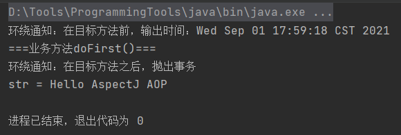
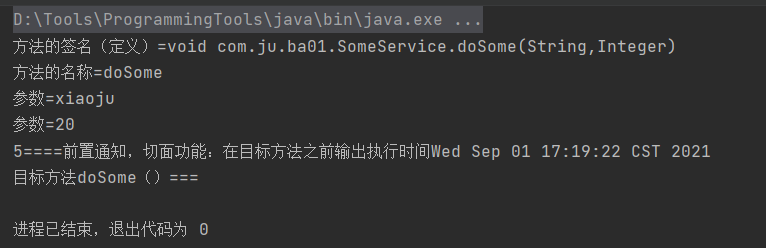

# Spring


java中创建对象的方式:

1. 构造方法，new Student()
2. 反射
3. 序列化
4. 克隆
5. ioc：容器创建对象
6. 动态代理

## 1、Spring创建

- 创建maven项目
- 加入maven依赖
  - spring依赖，版本5.2.5
  - junit依赖，方便测试程序
- 创建类（接口和它的实现类）
- 创建spring需要使用的配置文件：声明类的信息，这些类由spring进行创建和管理
- 测试spring创建对象


## 2、项目基础

xml文件中的配置：

```xml
<!--声明Student对象
        注入=赋值
        简单类型：spring中规定java的基本数据类型和String都是简单类型
        di：给属性赋值
        1.set注入（设置注入）：spring调用类的set方法，可以再set方法中完成属性赋值
            <bean id="xx" class="yyy">
                <property name="属性名字" value="此属性的值">
                    一个property只能给一个属性赋值
                </property>
            </bean>


        2.引用类型规定set注入： spring调用类的set方法
            <bean id="xx" class="yyy">
                <property name="属性名称" ref="bean的id(对象的名称)"></property>
            </bean>


        构造注入 ：spring调用类有参数的构造方法，在创建对象的同时，在构造方法中给属性赋值
        构造注入使用<constructor-arg></constructor-arg>
        一个<constructor-arg>表示构造方法的一个参数
        <constructor-arg>标签属性：
            name：表示构造方法的形参名
            index：表示构造方法参数的位置，参数从左往右0,1,2...
            value：构造方法的形参类型是简单类型的使用value
            ref：构造方法的形参类型是引用类型的使用ref
    -->
	<!--使用name属性实现构造注入-->
    <bean id="myStudent" class="com.ju.Student" >
        <constructor-arg name="myName" value="小橘"/>
        <constructor-arg name="myAge" value="20"/>
        <constructor-arg name="mySchool" ref="mySchool"/>
    </bean>

    <!--使用index属性-->
    <bean id="myStudent2" class="com.ju.Student" >
        <constructor-arg index="0" value="小橘"/>
        <constructor-arg index="1" value="20"/>
        <constructor-arg index="2" ref="mySchool"/>
    </bean>

    <!--声明School对象-->
    <bean id="mySchool" class="com.ju.School">
        <property name="name" value="仙院"/>
        <property name="address" value="九天十地"/>
    </bean>

    <bean id="myFile" class="java.io.File">
        <constructor-arg name="parent" value="D:\Tools\ProgrammingTools\Linux CentOS 7.8\Linux CentOS 7.8"/>
        <constructor-arg name="child" value="readme.txt"/>
    </bean>
```


**spring默认创建对象的时间：在创建spring容器时，会创建配置文件中的所有的对象spring创建对象：默认调用的是无参数的构造方法**


测试文件中的开头：

```java
		//使用spring容器创建对象
        //1.指定spring配置文件的名称
        String config = "beans.xml";
        //2.创建表示spring容器的对象，ApplicationContext
        // ApplicationContext表示spring容器，通过这个容器获取对象
        // ClassPathXmlApplicationContext：表示从类路径中加载spring的配置文件
        ApplicationContext ac = new ClassPathXmlApplicationContext(config);

        //从容器中获取对象
        //getBean("配置文件中的bean的id值")
        SomeService service = (SomeService) ac.getBean("someService");
```


### 自动注解


```xml
<!--
        引用类型的自动注入：spring框架根据某些规则可以给引用类型赋值。
        使用的规则常用的是byName，byType
        1.byName（按名称注入）：java类中引用类型的属性名和spring容器中（配置文件）<bean>的id名称一样
                            且数据类型是一直的，这样的容器中的bean，spring能够赋值给引用类型

               语法：
                    <bean id="xx" class="yyy" autowire="byName">
                        简单类型属性赋值
                    </bean>
        2.byType（按类型注入）：java类中引用类型的数据类型和spring容器中（配置文件）<bean>的class属性是同源关系，
                            这样的bean能够赋值给引用类型
        同源：
            1.java类中引用类型的数据类型和bean的class的值是一样的
            2.java类中引用类型的数据类型和bean的class的值是父子关系
            3.java类中引用类型的数据类型和bean的class的值接口和实现类关系的

                语法：
                    <bean id="xx" class="yyy" autowire="byType">
                        简单类型属性赋值
                    </bean>
                    
            注意：在byType中，在xml配置文件中声明bean只能有一个符合条件的，多余一个是错误的
    -->
	<bean id="myStudent" class="com.tang.Student" autowire="byType">
        <constructor-arg name="myName" value="王谢棠"/>
        <constructor-arg name="myAge" value="26"/>
	<!--<constructor-arg name="mySchool" ref="mySchool"/>-->
    </bean>
```


### 多配置文件

```xml
<!--spring-total表示主配置文件：包含其他的配置文件，主配置文件一般不定义对象
        语法：<import resource="其他配置文件的路径"/>
        关键字:"classpath"表示类路径(class文件所在的目录)，在spring的配置文件中要指定其他文件的位置
        需要使用classpath，告诉spring去哪加载读取文件
    -->
    <!--加载的是文件列表-->
<!--    <import resource="classpath:tang/spring-school.xml"/>-->
<!--    <import resource="classpath:tang/spring-student.xml"/>-->

    <!--
        在包含关系的配置文件中，可以使用通配符(*:表示任意字符)
        注意：1.主配置文件名称不能包含在通配符范围内（不能叫spring-total.xml）
            2.通配符所指向文件必须在同一目录中才能被读取
    -->
    <import resource="classpath:tang/spring-*.xml"/>
```


### 注解

基于注解的di：通过注解完成java对象创建，属性赋值

使用注解的步骤：

1. 加入maven的依赖 sprin-context，在你加入spring-context的同时，间接加入spring-aop的依赖。使用注解必须使用spring-aop
2. 在类中加入spring的注解（多个不同功能的注解）
3. 在spring的配置文件中，加入一个组件扫描器的标签，说明注解在你项目中的位置

学习注解

- @Component

  - ```java
    /*
    * @Component：创建对象的，等同于<bean>的功能
    *   属性：value就是对象的名称，也就是bean的id值
    *       value值是唯一的，创建的对象在整个spring容器中就一个
    *
    *	spring中和@Component功能一致，创建对象的注解还有：
    *	1.@Respotory（用在持久层类的上面）：放在dao的实现类上面，表示创建dao对象，dao对象是能访问数据库的
    *	2.@Service（用在业务层类的上面）：放在service的实现类上卖弄，创建service对象，
    		service对象化是做业务处理，可以有事务等功能
    	3.@Controller（用在控制器的上面）：放在控制器（处理器）类的上面，创建控制器对象的。
    		控制器对象，能够接收与欧诺个户提交的参数，显示请求的处理结果。
    		
    	以上三个注解的使用语法和@Component一样。都能创建对象，但是这三个注解还有额外的功能。
    	@Respotory，@Service，@Controller是给项目的对象分层的
    	
    	未指定使用层的对象使用@Component
    * */
    //@Component("myStudent")value可省略，最常用
    //不指定对象名称，由spring提供默认名称：类名的首字母小写
    @Component(value = "myStudent")
    ```

- @Respotory

- @Service

- @Controller

- @Value

  ```java
  /*
      * @Value:简单类型的属性赋值
      *   属性：value是String类型的，表示简单类型的属性值
      * 位置：1.在属性定义的上面，无需set方法，推荐使用
      *
      * */
      @Value(value = "王谢棠")
      private String name;
      @Value(value = "31")
      private int age;
  ```

  

- @Autowired

  ```java
  /*
      * 引用类型
      * @Autowired:spring框架提供的注解，实现引用类型的赋值。
      * spring中通过注解给引用类型赋值，使用的是自动注入原理，支持byName，byType
      *
      * @Autowired：默认使用的byType自动注入
      *
      * 位置：1.在属性定义的上面，无需set方法，推荐使用
      *       2.在set方法上面
      *
      * 如果要使用byName方式：
      * 1.在属性上面加入@Autowired
      * 2.在属性上面加入@Qualifier(value="bean的id")：表示使用指定名称的bean完成赋值
      *
      * */
      @Autowired
      @Qualifier("mySchool")
      private School school;
  ```

  - required

    ```java
    属性：required,是一个boolean类型的，默认为TRUE
         required=true:表示引用类型赋值失败，程序报错，并终止执行
         required=false:引用类型如果赋值失败，程序正常执行，引用类型是null
    ```

    

- @Resource

  ```java
  /*
      * 引用类型
      * @Resource：来自jdk中的注解，spring框架提供了对这个注解的功能支持，可以使用它给引用类型赋值
      *           使用的也是自动注入原理，支持byName，byType，默认值byName
      * 位置：1.在属性定义的上面，无需set方法，推荐使用
      *       2.在set方法的上面
      * */
      //默认是byName先试用byName自动注入，如果byName赋值失败，再使用byType
      @Resource
      private School school;
  
  	//只是用byName方式
  	//@Resource(name = "mySchool")
  ```

  


使用注解，实现步骤：

- 加入依赖

- 创建类，在类中加入注解

```java
/*
* @Component：创建对象的，等同于<bean>的功能
*   属性：value就是对象的名称，也就是bean的id值
*       value值是唯一的，创建的对象在整个spring容器中就一个
* */
@Component(value = "myStudent")
```


- 创建spring的配置文件，声明组件扫描器的标签，指明注解在你的项目中的位置

  - ```xml
    <!--声明组件扫描器(component-scan)，组件就是java对象
            base-package：指定注解在你的项目中的包名。
            component-scan工作方式：spring会扫描遍历base-package指定的包，
                把包中和子包中的所有类，找到类中的注解，按照注解的功能创建对象，或给属性赋值
    
            加入component-scan标签，配置文件的变化：
            1.加入一个新的约束文件spring-context.xsd
            2.给新的约束文件起个命名空间的名称xmlns:context="http://www.springframework.org/schema/context"
        -->
        <context:component-scan base-package="com.ju.ba01"/>
    ```

  - 指定多个包的三种方式：  

    ```xml
    <!--指定多个包的三种方式-->
        <!--1.使用多次组件扫描器，指定各不同的包-->
        <context:component-scan base-package="com.ju.ba01"/>
        <context:component-scan base-package="com.ju.ba02"/>
    
        <!--2.使用分隔符（;或,）分隔多个包名-->
        <context:component-scan base-package="com.ju.ba01;com.ju.ba02"/>
    
        <!--3.指定父包-->
        <context:component-scan base-package="com.ju"/>
    ```

    

- 使用注解创建对象，创建容器ApplicationContext


## 3、动态代理

动态代理：可以再程序的执行过程中，创建代理对象。通过代理对象执行方法，给目标类的方法增加额外的功能（功能增强）。

jdk动态代理实现步骤：

1. 创建目标类，SomeServiceImpl目标类，给她doSome，doOther增加输出时间，事务。
2. 创建InvocationHandler接口实现类，在这个类实现给目标方法增加功能
3. 使用jdk中类Proxy，创建代理对象。实现创建对象的能力。


cglib动态代理：第三方工具库，创建代理对象，原理是继承。通过继承目标类，创建子类。子类就是代理对象。要求目标类不是final的，方法也不是final的。

- 目标类没有接口，使用cglib动态代理，spring框架会自动化应用cglib
- 


### **动态代理的作用**

1. 在目标类源代码不改变的情况下，增加功能。
2. 减少代码的重复
3. 专注业务逻辑代码
4. 解耦合，让业务功能和日志，事务非业务功能分离


### Aop（Aspect Oriented Programming）

面向切面编程，基于动态代理的，可以使用jdk，cglib两种代理方式。

Aop就是动态代理的规范化，把动态代理的实现步骤，方式都定义好了，让开发人员用一种统一的方式，使用动态代理。


术语：

1. Aspect：切面，表示增强的功能，就是一堆代码，完成某个功能。非业务功能，常见的切面功能有日志，事务，统计信息，参数检查，权限验证。
2. JoinPoint：连接点，连接业务方法和切面的位置，就某类中的业务方法。
3. Pointcut：切入点，指多个连接点方法的集合。多个方法
4. 目标对象：给哪个类的方法增加功能，这个类就是目标对象
5. Advice：通知，表示切面功能执行的时间


怎么理解面向切面编程：

1. 需要在分析项目功能时，找出切面。
2. 合理的安排切面的执行时间（在目标方法前，还是目标方法后）。
3. 合理的安排切面执行的时间，在哪个类，哪个方法增加增强功能。


### aop的实现

aop是一个规范，是动态的一个规范化，一个标准。

aop1的技术实现框架：

1. spring内部实现了aop规范，能做aop工作。spring主要在事务处理时使用aop，项目开发中很少使用spring的aop实现，因为比较笨重
2. aspectJ：一个开源的专门做aop的框架。spring框架中继承了aspectJ框架，通过spring就能使用aspectJ的功能。

aspectJ框架实现aop有两种方式：

1. 使用xml配置文件：配置全局事务
2. 使用注解，常用，有五个注解


aspectJ框架的使用：

- 在切面执行时间，这个执行时间在规范中国叫做Advice（通知，增强）。

  - @Before（使用方法如下）

  - @AfterReturning

    ```java
    /*
        * 后通知定义方法，定义实现切面功能的方法
        * 要求：
        * 1.公共方法public
        * 2.方法没有返回值
        * 3.方法名称自定义
        * 4.方法有参数，推荐是Object，参数名自定义
        * */
    
        /*
        * @AfterReturning:后置通知
        *   属性：1.value 切入点表达式
        *          2.returning 自定义的变量，表示目标方法的返回值。
        *              自定义变量名必须和通知方法的形参名一样 (returning = "res"  对应  Object res)
        *   特点：
        *   1.在目标方法之后执行的。
        *   2.能够获取到目标方法的返回值，可以根据这个返回值做不同的处理功能
        *   3.可以修改这个返回值
        * */
        @AfterReturning(value = "execution(* *..SomeServiceImpl.doOther(..))",
                returning = "res")
        public void myAfterReturning(Object res){
            // Object res：是目标方法执行后的返回值，根据返回值做你的切面的功能处理
            System.out.println("后置通知，返回值为 = " + res);
        }
    ```

    

  - @Around

    ```java
    /*
        * 环绕通知方法的定义格式
        *   1.public
        *   2.必须有一个返回值，推荐使用Object
        *   3.方法名称自定义
        *   4.方法有参数，固定的参数 ProceedingJoinPoint
        * */
    
        /*
        * @Around：环绕通知
        *   属性：value  切入点表达式
        *
        * 特点：
        *   1.功能最强
        *   2.在目标方法的前和后都可以增强功能
        *   3.能控制目标方法是否被调用执行
        *   4.修改原来的目标方法的执行结果。 影响最后的调用结果
        *
        *   环绕通知，等同于jdk动态代理的，InvocationHandler接口
        *
        *   参数： ProceedingJoinPoint 等同于 Method
        *           作用：执行目标方法
        *   返回值： 就是目标方法的执行结果，可以被修改
        *
        *   环绕通知：经常做事务，在目标方法之前开启事务，执行目标方法，在目标方法之后提交事务
        * 
        * 
        * */
    
        @Around(value = "execution(*  *..SomeServiceImpl.doFirst(..))")
        public Object myAround(ProceedingJoinPoint pjp) throws Throwable {
    
            String name = null;
            //获取第一个参数值
            Object args [] = pjp.getArgs();
            if (args != null && args.length > 1){
                Object arg = args[0];
                name = (String) arg;
            }
    
            //实现环绕通知
            Object result = null;
            System.out.println("环绕通知：在目标方法前，输出时间："  + new Date());
            //1.目标方法调用
            if("王谢棠".equals(name)){
                result = pjp.proceed();
            }
    
            System.out.println("环绕通知：在目标方法之后，抛出事务");
            //2.在目标方法的前或后加入功能
    
            //修改目标方法的执行结果，影响方法最后的调用结果
            if( result != null){
                result = "Hello AspectJ AOP";
            }
    
            //返回目标方法的执行结果
            return result;
        }
    ```

    

  - @AfterThrowing

  - @After

- 表示切面执行的位置，使用切入点表达式。


使用aspectJ实现aop的步骤：

1. 新建maven项目

2. 加入依赖：

   1. spring依赖

   2. aspectJ依赖

      ```xml
      <dependency>
            <groupId>org.springframework</groupId>
            <artifactId>spring-context</artifactId>
            <version>5.2.5.RELEASE</version>
          </dependency>
          <dependency>
            <groupId>org.springframework</groupId>
            <artifactId>spring-aspects</artifactId>
            <version>5.2.5.RELEASE</version>
        </dependency>
      ```

      

3. 创建目标类：接口和它的实现类。给类中增加方法。

4. 创建切面类：普通类

   1. 在类的上面加入@Aspect

   2. 在类中定义方法，方法就是切面要执行的功能代码，在方法上面加入aspectJ中的通知注解，例如@Before。有需要执行切入点表达式execution()

      ```java
      package com.ju.ba01;
      
      import org.aspectj.lang.annotation.Aspect;
      import org.aspectj.lang.annotation.Before;
      
      import java.util.Date;
      
      /*
      * @Aspect:是aspectj框架中的注解
      *   作用：表示当前类是切面类
      *   切面类：用来给业务方法增加功能的类，在这个类中有切面的功能代码
      *   位置：在类定义的上面
      * */
      @Aspect
      public class MyAspect {
          /*
          * 定义实现切面功能的方法
          * 要求：
          * 1.公共方法public
          * 2.方法没有返回值
          * 3.方法名称自定义
          * 4.方法可以有参数，也可以没有参数
          *   如果有参数，参数不是自定义的，有几个参数类型可以使用
          * */
      
          /*
          * @before():前置通知注解
          *   属性：value，是切入点表达式，表示切面功能执行的位置。
          *   位置：在方法的上面
          * 特点：
          *   1.在目标方法之前先执行的
          *   2.不会改变目标方法的执行结果
          *   .3.不会影响目标方法的执行
          * */
      
      
          //@Before的几种写法
          
          /*@Before(value = "execution(public void com.ju.ba01.SomeServiceImpl.doSome(String,Integer))")
          public void myBefore(){
              //切面要执行的功能代码
              System.out.println("前置通知，切面功能：在目标方法之前输出执行时间"+ new Date());
          }*/
      
          /*@Before(value = "execution( void *..SomeServiceImpl.doSome(String,Integer))")
          public void myBefore(){
              //切面要执行的功能代码
              System.out.println("====前置通知，切面功能：在目标方法之前输出执行时间"+ new Date());
          }*/
      
          @Before(value = "execution( * *..SomeServiceImpl.do*(..))")
          public void myBefore(){
              //切面要执行的功能代码
              System.out.println("5====前置通知，切面功能：在目标方法之前输出执行时间"+ new Date());
          }
      }
      
      ```

      

5. 创建spring配置文件：声明对象，把对象交给容器同一管理。声明对象控而已使用注解或者xml配置文件

   1. 声明目标对象

   2. 声明切面类对象

   3. 声明aspectJ框架中的自动代理生成器标签。

      自动代理生成器：用来完成代理对象的自动创建功能的。

      ```xml
      <!--把对象交给spring容器，由spring容器统一创阿金，管理对象-->
          <!--声明目标对象-->
          <bean id="someService" class="com.ju.ba01.SomeServiceImpl"/>
      
          <!--声明切面类对象-->
          <bean id="myAspect" class="com.ju.ba01.MyAspect"/>
      
          <!--声明自动代理生成器：使用aspectj框架内部的功能，创建目标对象的代理对象。
              创建代理对象是在内存中实现的，修改目标对象的内存中的结构。创建为代理对象。所以目标对象就是被修改后的代理对象
      
              aspectj-autoproxy:会把spring容器中的虽有的目标对象一次性都生成代理对象。
          -->
          <aop:aspectj-autoproxy/>
      ```

      

6. 创建测试类，从spring容器中获取目标对象（实际就是代理对象）。

   通过代理执行方法，实现aop的功能增强


### JoinPoint

```java
/*
    * 指定通知方法中的参数 ：JoinPoint
    * JoinPoint：业务方法，要加入切面功能的业务方法
    *       作用是：可以再通知方法中虎丘方法执行时的信息，例如方法名称，方法的实参。
    *       如果你的切面功能中需要用到方法的信息，就加入JoinPoint.
    *       这个JoinPoint参数的值是由方法赋予的，必须是第一个位置的参数
    * */
    @Before(value = "execution( * *..SomeServiceImpl.do*(..))")
    public void myBefore(JoinPoint jp){
        //获取方法的完整定义
        System.out.println("方法的签名（定义）="+ jp.getSignature());
        System.out.println("方法的名称=" + jp.getSignature().getName());
        //获取方法的实参
        Object args []  = jp.getArgs();
        for (Object arg:args){
            System.out.println("参数=" + arg);
        }
        //切面要执行的功能代码
        System.out.println("5====前置通知，切面功能：在目标方法之前输出执行时间"+ new Date());
    }
```

返回值：




## 4、spring和mybatis

使用ioc技术集成两个框架：

​	能把mybatis和spring集成在一起，像一个框架，是因为ioc能创建对象。可以吧mybatis框架中的对象交给spring统一创建，开发人员从spring中获取对象。开发人员就不用同时面对两个或多个框架了，就面对一个spring。


### mybatis使用

1. 定义dao接口，StudentDao

2. 定义mapper文件，StudentDao.xml

3. 定义mybatis的主配置文件 mybatis.xml

4. 创建dao的代理对象
```java
StudentDao dao = SQLSession.getMapper(StudentDao.class);

List<Student> students = dao.selectStudents();
```

### 使用

#### 项目步骤：

1. 新建maven项目
2. 加入maven依赖
   1. spring依赖
   2. mybatis依赖
   3. mysql驱动
   4. spring的事务的依赖
   5. mybatis和spring集成的依赖：mybatis官方提供，用来在spring项目中创建mybatis的SqlSessionFactory,dao对象的
3. 创建实体类
4. 创建dao接口和mapper文件
5. 创建mybatis主配置文件
6. 创建Service接口和实现类，属性是dao
7. 创建spring的配置文件：声明mybatis的对象交给spring创建
   1. 数据源DataSource
   2. SqlSessionFactory
   3. Dao对象
   4. 声明自定义的service
8. 创建测试类，获取Service对象，通过service调用dao完成数据库的访问


#### 完整依赖：

```xml
<dependencies>
    <dependency>
      <groupId>junit</groupId>
      <artifactId>junit</artifactId>
      <version>4.11</version>
      <scope>test</scope>
    </dependency>
    <!--spring事务-->
    <dependency>
      <groupId>org.springframework</groupId>
      <artifactId>spring-context</artifactId>
      <version>5.2.5.RELEASE</version>
    </dependency>
    <dependency>
      <groupId>org.springframework</groupId>
      <artifactId>spring-tx</artifactId>
      <version>5.2.5.RELEASE</version>
    </dependency>
    <dependency>
      <groupId>org.springframework</groupId>
      <artifactId>spring-jdbc</artifactId>
      <version>5.2.4.RELEASE</version>
    </dependency>
    <dependency>
      <groupId>org.mybatis</groupId>
      <artifactId>mybatis</artifactId>
      <version>3.5.0</version>
    </dependency>
    <dependency>
      <groupId>org.mybatis</groupId>
      <artifactId>mybatis-spring</artifactId>
      <version>1.3.0</version>
    </dependency>
    <dependency>
      <groupId>mysql</groupId>
      <artifactId>mysql-connector-java</artifactId>
      <version>8.0.25</version>
    </dependency>
    <!--阿里公司的数据库连接池-->
    <dependency>
      <groupId>com.alibaba</groupId>
      <artifactId>druid</artifactId>
      <version>1.1.10</version>
    </dependency>
  </dependencies>

  <build>
    <resources>
      <resource>
        <directory>src/main/java</directory><!--所在的目录-->
        <includes><!--包括目录下的.properties,.xml 文件都会扫描到-->
          <include>**/*.properties</include>
          <include>**/*.xml</include>
        </includes>
        <filtering>false</filtering>
      </resource>
    </resources>
    <plugins>
      <plugin>
        <groupId>org.apache.maven.plugins</groupId>
        <artifactId>maven-compiler-plugin</artifactId>
        <version>3.1</version>
        <configuration>
          <source>1.8</source>
          <target>1.8</target>
        </configuration>
      </plugin>
    </plugins>
  </build>
```


## 5、spring事务

事务是指一组sql语句的集合。集合中有多条sql语句。我们希望这些sql语句都成功或者都失败，这些sql语句的执行时一致的，作为一个整体执行。

在java代码中写程序，控制事务，事务应该放在service类的业务方法上，因为业务方法会调用多个sql语句。


处理事务：

1. 事务内部提交，回滚事务，使用的事务管理器对象，完成commit，rollback

   事务管理器是一个接口和众多实现类。

   接口：PlatformTransactionMapper，定义了事务重要方法commit，rollback

   实现类：spring把每一种数据库访问技术对应的事务处理类都创建好了。

   ​		mybatis——DataSourceTransactionMapper

   ​		hibernate——HibernateTransactionMapper

   使用：
   ```xml
   <bean id="xxx" class="...DataSourceTransactionMapper">
   ```

2. 业务方法需要说明事务的类型

   1. 事务的隔离级别：

      这些常量均是以 ISOLATION_开头。即形如 ISOLATION_XXX。 

       DEFAULT：采用 DB 默认的事务隔离级别。MySql 的默认为 REPEATABLE_READ； Oracle默认为 READ_COMMITTED。 

      - READ_UNCOMMITTED：读未提交。未解决任何并发问题。 

      - READ_COMMITTED：读已提交。解决脏读，存在不可重复读与幻读。

      - REPEATABLE_READ：可重复读。解决脏读、不可重复读，存在幻读

      - SERIALIZABLE：串行化。不存在并发问题。

   2. 事务的超时时间：表示一个方法最长的执行时间，如果方法执行时超过了时间，事务就回滚。单位是秒，整数值，默认是-1

   3. 事务的传播行为：控制业务方法是不是有事务的，是什么样的事务

      7个传播行为：

      - **PROPAGATION_REQUIRED**

      - **PROPAGATION_REQUIRES_NEW**

      - **PROPAGATION_SUPPORTS**

        （重点以上）

      - PROPAGATION_MANDATORY 

      - PROPAGATION_NESTED

      - PROPAGATION_NEVER

      - PROPAGATION_NOT_SUPPORTED


### 步骤

1. 新建maven项目

2. 加入maven依赖

   1. spring依赖
   2. mybatis依赖
   3. mysql驱动
   4. spring的事务的依赖
   5. mybatis和spring集成的依赖：mybatis官方提供，用来在spring项目中创建mybatis的SqlSessionFactory,dao对象的

3. 创建实体类

   Sale，Goods

4. 创建dao接口和mapper文件

   SaleDao接口，GoodsDao接口

   SaleDao.xml,GoodsDao.xml

5. 创建mybatis主配置文件

6. 创建Service接口和实现类，属性是saleDao,goodsDao

7. 创建spring的配置文件：声明mybatis的对象交给spring创建

   1. 数据源DataSource
   2. SqlSessionFactory
   3. Dao对象
   4. 声明自定义的service

8. 创建测试类，获取Service对象，通过service调用dao完成数据库的访问


### 使用spring事务注解管理事务

通过@Transactional 注解方式，可将事务织入到相应 public 方法中，实现事务管理。

@Transactional 的所有可选属性如下所示：

- propagation：用于设置事务传播属性。该属性类型为 Propagation 枚举，默认值为Propagation.REQUIRED。 

- isolation：用于设置事务的隔离级别。该属性类型为 Isolation 枚举，默认值为Isolation.DEFAULT。 

- readOnly：用于设置该方法对数据库的操作是否是只读的。该属性为 boolean，默认值为 false。 

- timeout：用于设置本操作与数据库连接的超时时限。单位为秒，类型为 int，默认值为-1，即没有时限。

- rollbackFor：指定需要回滚的异常类。类型为 Class[]，默认值为空数组。当然，若只有一个异常类时，可以不使用数组。

- rollbackForClassName：指定需要回滚的异常类类名。类型为 String[]，默认值为空数组。当然，若只有一个异常类时，可以不使用数组。

- noRollbackFor：指定不需要回滚的异常类。类型为 Class[]，默认值为空数组。当然，若只有一个异常类时，可以不使用数组。

- noRollbackForClassName：指定不需要回滚的异常类类名。类型为 String[]，默认值为空数组。当然，若只有一个异常类时，可以不使用数组。

需要注意的是，@Transactional 若用在方法上，只能用于 public 方法上。对于其他非 public方法，如果加上了注解@Transactional，虽然 Spring 不会报错，但不会将指定事务织入到该方法中。因为 Spring 会忽略掉所有非 public 方法上的@Transaction 注解。

若@Transaction 注解在类上，则表示该类上所有的方法均将在执行时织入事务。


#### 使用@Transactional的步骤：

1. 需要声明事务管理器对象

  ```xml
  <bean id="xx" class="DataSourceTransactionaManager">
  ```

2. 开启事务注解驱动，告诉spring框架，我要使用注解的方式管理事务

   @Around("要增加的事务功能的业务方法名称")

   Object myAround(){

   ​	开启事务，spring给你开启

   ​	try{

   ​		buy(1001,10);

   ​		spring的事务管理.cmommit();

   }catch(Exception e){

   ​		spring的事务管理.rollback();

   ​	}

   }

3. 在方法的上面加入@Transactional

   ```java
   /*
       * rollbackFor:表示发生指定的异常一定回滚
       *
       * */
       @Transactional(
               propagation = Propagation.REQUIRED,
               isolation = Isolation.DEFAULT,
               readOnly = false,
               rollbackFor = {
                       NullPointerException.class,
                       NotEnoughException.class
               }
       )
   ```

   

#### 使用aspectJ的步骤：都是在xml配置文件中实现

1. 加入依赖

   ```xml
   <dependency> 
       <groupId>org.springframework</groupId> 
       <artifactId>spring-aspects</artifactId> 
       <version>5.2.5.RELEASE</version>
   </dependency>
   
   ```

2. 声明事务管理器对象
```xml
<bean id="xx" class="DataSourceTransactionaManager">
```

3. 声明方法需要的事务类型（配置方法的事务属性: 隔离级别，传播行为，超时）

4. 配置aop：指定哪些类需要创建代理

