#  正则表达式

1.[正则在线测试网站](https://regexr-cn.com/)

2.[正则练习网站](https://codejiaonang.com/)

##  基础

1. `^`实现取反操作：

`n\[^e]` 则表示`n`后面不能为字符`e`

2. `\w` 可以与**任意单词字符**匹配

| 快捷方式 | 描述                                                         |
| -------- | ------------------------------------------------------------ |
| \w       | 与任意单词字符匹配，任意单词字符表示 `[A-Z]`、 `[a-z]`、`[0-9]`、`_` |
| \d       | 与任意数字匹配                                               |

3. `\s`快捷方式可以**匹配空白字符**，比如空格，tab、换行等。

4. `\b` 匹配的是单词的边界，例如：

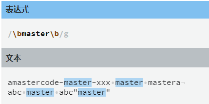

​				`\bmaster\b` 就仅匹配有边界的`master`单词。

5. 快捷方式也可以取反，例如对于`\w`的取反为`\W`，将小写改写成大写即可，其他快捷方式也遵循这个规则。示例：

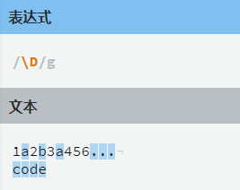

6. 正则表达式中 `^`指定的是一个字符串的开始，`$`指定的是一个字符串的结束。例如：

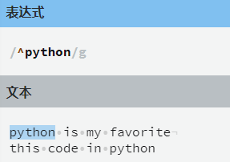

指定字符串的结束：

​										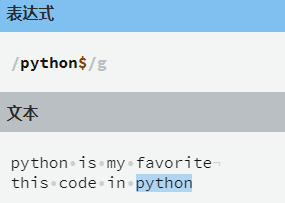

7. `.`字符代表匹配任何单个字符，它**只能出现在方括号以外**。**值得注意的是：** `.`字符只有一个不能匹配的字符，也就是换行符（`\n`），不过要让`.`字符与换行符匹配也是可以的，以后会讨论。示例：

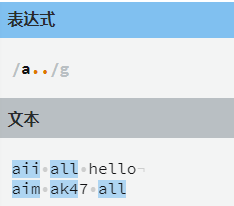

8. 有时，我们可能想要匹配一个单词的不同写法，比如`color`和`colour`，或者`honor`与`honour`。

   这个时候我们可以使用 `?` 符号指定一个字符、字符组或其他基本单元可选，这意味着正则表达式引擎将会期望该字符出现**零次或一次**。例如：

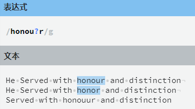

在这里 `u?` 表示`u`是可选的，即可以出现也可以不出现，可以匹配的是 `honor` 和 `honour` 。

通过这个案例可以知道`?`的作用就是匹配它之前的字符`0`次或`1`次。	

9. 在一个字符组后加上`{N}` 就可以表示在它之前的字符组出现`N`次。

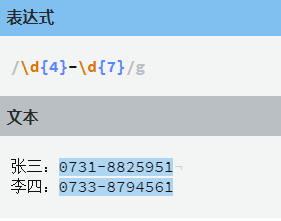

10. 可能有时候，我们不知道具体要匹配字符组要重复的次数，比如身份证有`15`位也有`18`位的。

    这里重复区间就可以出场了，语法：`{M,N}`，`M`是下界而`N`是上界。

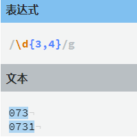

`\d{3,4}` 既可以匹配`3`个数字也可以匹配`4`个数字，不过当有`4`个数字的时候，优先匹配的是`4`个数字，这是因为正则表达式默认是**贪婪模式**，即尽可能的匹配更多字符，而要使用**非贪婪模式**，我们要在**表达式后面加上 `?`号**。

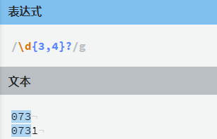

11. 有时候我们可能遇到字符组的重复次数没有边界，例如：

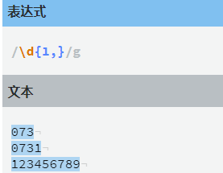

闭区间不写即可表示匹配一个或无数个。

还可以使用两个速写字符指定常见的重复情况，可以使用 `+` 匹配`1`个到无数个，使用 `*`代表`0`个到无数个。

即：`+`等价于`{1,}`，`*`等价于`{0,}`。

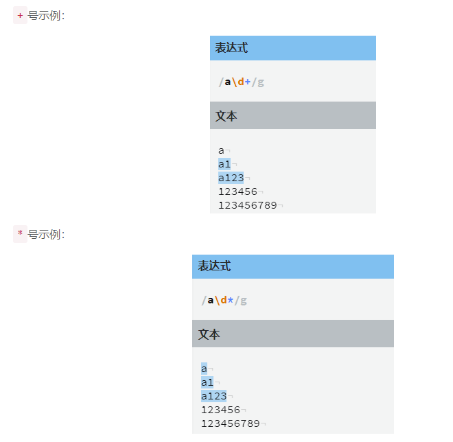

##  进阶

###  分组

在正则表达式中还提供了一种将表达式**分组**的机制，当使用分组时，除了获得整个匹配。还能够在匹配中选择每一个分组。

要实现分组很简单，使用`()`即可。

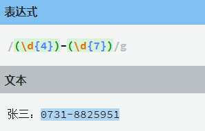

这段正则表达式将文本**分成了两组**，第一组为：`0731`，第二组为`8825951`。

分组有一个非常重要的功能——`捕获数据`。所以`()`被称为捕获分组，用来捕获数据，当我们想要从匹配好的数据中提取关键数据的时候可以使用分组。

`(\d{4})` 和 `(\d{7})`就分别捕获了两段数据：

1. `0731`
2. `8825951`

###  或者条件

使用分组的同时还可以使用 **或者**（`or`）条件。

例如要提取所有图片文件的后缀名，可以在各个后缀名之间加上一个 `|`符号：

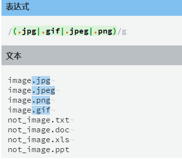

###  非捕获分组

有时候，我们并不需要捕获某个分组的内容，但是又想使用分组的特性。

这个时候就可以使用非捕获组`(?:表达式)`，从而**不捕获数据**，还能使用分组的功能。

例如想要匹配**两个字母组成的单词**或者**四个字母组成的单词**就可以使用**非捕获分组**：

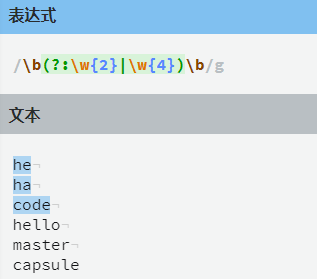

###  分组的回溯引用

正则表达式还提供了一种引用之前匹配分组的机制，有些时候，我们或许会寻找到一个子匹配，该匹配接下来会再次出现。

例如，要匹配一段 HTML 代码，比如：`0123提示abcd`，可能会编写出这样一段正则表达式：

这确实可以匹配，不过可能还有另一种情况，如果数据改成这样：`提示</bar>`

在这里`font` 和 `bar` 明显不是一对正确的标签，但是我们编写的正则表达式还是将它们给匹配了，所以这个结果是错误的。

我们想让后面分组的正则也匹配`font`，但是现在所有形式的都会匹配。

那如果想让后面分组的正则和第一个分组的正则匹配同样的数据该如何做呢？

可以使用**分组的回溯引用**，使用`\N`可以引用编号为`N`的分组，因此上述例子的代码我们可以改为：

通过这个例子，可以发现 `\1` 表示的就是第一个分组，在这里第一个分组匹配的是 `font` 所以`\1` 就代表`font`。

##  规则

| 实例 | 描述                                                         |
| ---- | ------------------------------------------------------------ |
| `.`  | 匹配除 “\n” 之外的任何单个字符。要匹配包括 ‘\n’ 在内的任何字符，请使用象 ‘[.\n]’ 的模式。 |
| `?`  | 匹配一个字符零次或一次，另一个作用是非贪婪模式               |
| `+`  | 匹配1次或多次                                                |
| `*`  | 匹配0次或多次                                                |
| `\b` | 匹配一个长度为`0`的子串                                      |
| `\d` | 匹配一个数字字符。等价于 [0-9]。                             |
| `\D` | 匹配一个非数字字符。等价于 [^0-9]。                          |
| `\s` | 匹配任何空白字符，包括空格、制表符、换页符等等。等价于 [ \f\n\r\t\v]。 |
| `\S` | 匹配任何非空白字符。等价于 [^ \f\n\r\t\v]。                  |
| `\w` | 匹配包括下划线的任何单词字符。等价于’[A-Za-z0-9_]’。         |
| `\W` | 匹配任何非单词字符。等价于 ‘[^A-Za-z0-9_]‘。                 |
| `\b` | 匹配一个长度为`0`的子串                                      |

