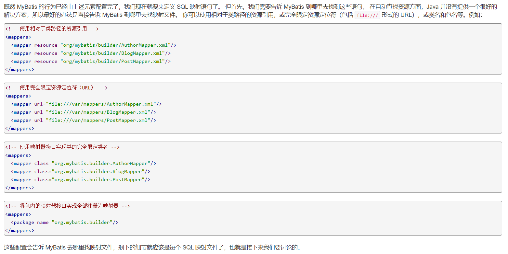
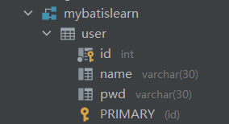
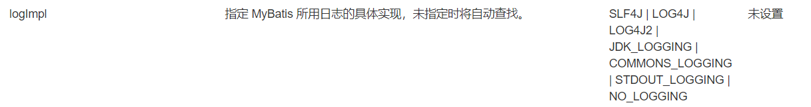

# MyBatis

## 1、概述

### 1.1、持久化

数据持久化

* 持久化就是将程序的数据在持久状态和瞬时状态转化的过程。
* 内存：断电即失
* 数据库（JDBC），io文件持久化

**为什么需要持久化**

- 有一些对象，不能让他丢掉
- 内存太贵


### 1.2、持久层

Dao层，Service层，Controller层..

- 完成持久化工作的代码块
- 层界限十分明显


### 1.3、MyBatis的用处

- 帮助程序员将数据存入数据库

- 方便
- 传统JDBC代码过于复杂。简化，框架，自动化
- 优点：
  - 简单易学：本身就很小且简单。没有任何第三方依赖，最简单安装只要两个jar文件+配置几个sql映射文件易于学习，易于使用，通过文档和源代码，可以比较完全的掌握它的设计思路和实现。
  - 灵活：mybatis不会对应用程序或者数据库的现有设计强加任何影响。 sql写在xml里，便于统一管理和优化。通过sql语句可以满足操作数据库的所有需求。
  - 解除sql与程序代码的耦合：通过提供DAO层，将业务逻辑和数据访问逻辑分离，使系统的设计更清晰，更易维护，更易单元测试。sql和代码的分离，提高了可维护性。
  - 提供映射标签，支持对象与数据库的orm字段关系映射
  - 提供对象关系映射标签，支持对象关系组建维护
  - 提供xml标签，支持编写动态sql。


**使用的人多**


## 2、Mybatis程序

搭建环境——>导入Mybatis——>编写代码——>测试

### 2.1、搭建环境

#### 2.1.1、创建项目


1.新建一个maven项目

2.删除src目录

3.导入maven依赖

#### 2.1.2、创建模块

- 编写mybatis的核心配置文件

  ```java
  <?xml version="1.0" encoding="UTF-8" ?>
  <!DOCTYPE configuration
          PUBLIC "-//mybatis.org//DTD Config 3.0//EN"
          "http://mybatis.org/dtd/mybatis-3-config.dtd">
  <!--核心配置文件-->
  <configuration>
      <environments default="development">
          <environment id="development">
              <transactionManager type="JDBC"/>
              <dataSource type="POOLED">
                  <property name="driver" value="com.mysql.jdbc.Driver"/>
                  <property name="url" value="jdbc:mysql://localhost:3306/mybatislearn?useSSL=true&amp;useUnicode=true&amp;characterEncoding=UTF-8"/>
                  <property name="username" value="root"/>
                  <property name="password" value="tan187734304"/>
              </dataSource>
          </environment>
      </environments>
      <mappers>
          <mapper resource="org/mybatis/example/BlogMapper.xml"/>
      </mappers>
  </configuration>
  ```

- 编写mybatis工具类

  ```java
  package com.ju.utils;
  
  import org.apache.ibatis.io.Resources;
  import org.apache.ibatis.session.SqlSession;
  import org.apache.ibatis.session.SqlSessionFactory;
  import org.apache.ibatis.session.SqlSessionFactoryBuilder;
  
  import java.io.IOException;
  import java.io.InputStream;
  
  public class MybatisUtils {
      
      private static SqlSessionFactory sqlSessionFactory;
      
      static {
          //使用mybatis第一步：获取SqlSessionFactory对象
          try {
              String resource = "org/mybatis/example/mybatis-config.xml";
              InputStream inputStream = Resources.getResourceAsStream(resource);
               sqlSessionFactory = new SqlSessionFactoryBuilder().build(inputStream);
          } catch (IOException e) {
              e.printStackTrace();
          }
      }
      
      public static SqlSession getSqlSession(){
          return sqlSessionFactory.openSession();
      }
  }
  
  ```


### 2.2、编写代码

- 实体类

  ```java
  package com.ju.pojo;
  
  public class User {
      private int id;
      private String name;
      private String pwd;
      
      public User(){
          
      }
  
      public int getId() {
          return id;
      }
  
      public void setId(int id) {
          this.id = id;
      }
  
      public String getName() {
          return name;
      }
  
      public void setName(String name) {
          this.name = name;
      }
  
      public String getPwd() {
          return pwd;
      }
  
      public void setPwd(String pwd) {
          this.pwd = pwd;
      }
  
      @Override
      public String toString() {
          return "User{" +
                  "id=" + id +
                  ", name='" + name + '\'' +
                  ", pwd='" + pwd + '\'' +
                  '}';
      }
  }
  
  ```

- Dao接口

  ```java
  public interface UserDao {
      List<User> getUserList();
  }
  
  ```

- 接口实现类:由原来的UserDaoImp转变为一个Mapper配置文件.

  ```java
  <?xml version="1.0" encoding="UTF-8" ?>
  <!DOCTYPE mapper
          PUBLIC "-//mybatis.org//DTD Mapper 3.0//EN"
          "http://mybatis.org/dtd/mybatis-3-mapper.dtd">
  <!--namespace=绑定一个对应的Dao/Mapper接口-->
  <mapper namespace="com.ju.dao.UserDao">
      <select id="getUserList" resultType="com.ju.pojo.User">
          select * from mybatislearn.user 
      </select>
  </mapper>
  ```


### 2.3、测试


## 3、CRUD

### 1.xml文件中：

- namespace中的包名要和Dao/Mapper接口的包名一致
- id：对应namespace中的方法名
- resultType：sql语句执行的返回值（默认为int）
- parameterType：传入参数类型（默认为int）
- 增删改查对应使用的标签：select,insert,update,delete
- **增删改需要提交事务：sqlSession.commit();**


## 4、配置解析

### 1、核心配置文件

- configuration（配置）
  - [properties（属性）](https://mybatis.org/mybatis-3/zh/configuration.html#properties)
  - [settings（设置）](https://mybatis.org/mybatis-3/zh/configuration.html#settings)
  - [typeAliases（类型别名）](https://mybatis.org/mybatis-3/zh/configuration.html#typeAliases)
  - [typeHandlers（类型处理器）](https://mybatis.org/mybatis-3/zh/configuration.html#typeHandlers)
  - [objectFactory（对象工厂）](https://mybatis.org/mybatis-3/zh/configuration.html#objectFactory)
  - [plugins（插件）](https://mybatis.org/mybatis-3/zh/configuration.html#plugins)
  - environments（环境配置）
    - environment（环境变量）
      - transactionManager（事务管理器）
      - dataSource（数据源）
  - [databaseIdProvider（数据库厂商标识）](https://mybatis.org/mybatis-3/zh/configuration.html#databaseIdProvider)
  - [mappers（映射器）](https://mybatis.org/mybatis-3/zh/configuration.html#mappers)

### 2、环境配置（environments）

```xml
<environments default="development">
        <environment id="development">
            <transactionManager type="JDBC"/>
            <dataSource type="POOLED">
                <property name="driver" value="${driver}"/>
                <property name="url" value="${xiaoju.url}"/>
                <property name="username" value="${username}"/>
                <property name="password" value="${password}"/>
            </dataSource>
        </environment>
    </environments>
    
```


**尽管可以配置多个环境，但每个 SqlSessionFactory 实例只能选择一种环境。**

注意一些关键点:

- 默认使用的环境 ID（比如：default="development"）。
- 每个 environment 元素定义的环境 ID（比如：id="development"）。
- 事务管理器的配置（比如：type="JDBC"）。
- 数据源的配置（比如：type="POOLED"）。


**事务管理器（transactionManager）**

在 MyBatis 中有两种类型的事务管理器（也就是 type="[JDBC|MANAGED]"）：

- JDBC – 这个配置直接使用了 JDBC 的提交和回滚设施，它依赖从数据源获得的连接来管理事务作用域。

- MANAGED – 这个配置几乎没做什么。它从不提交或回滚一个连接，而是让容器来管理事务的整个生命周期（比如 JEE 应用服务器的上下文）。 默认情况下它会关闭连接。然而一些容器并不希望连接被关闭，因此需要将 closeConnection 属性设置为 false 来阻止默认的关闭行为。例如:

  ```xml
  <transactionManager type="MANAGED">
    <property name="closeConnection" value="false"/>
  </transactionManager>
  ```


### 3、属性（properties）

引用外部资源文件进行配置：

```xml
<!--引入外部配置文件-->
    <properties resource="db.properties">
<!--        <property name="username" value="root"/>-->
    </properties>
```


db.properties：

```properties
driver=com.mysql.cj.jdbc.Driver
xiaoju.url=jdbc:mysql://localhost:3306/mybatislearn?useSSL=true&useUnicode=true&characterEncoding=UTF-8
username=root
password=tan187734304
```

**也可在properties内部进行属性的配置，但是会优先使用外部引入的db.properties中的属性**


**`注意：外部资源包中的路径名称使用url会报错（目前解决方法是自定义名称）`**


### 4、类型别名（typeAliases）

- 类型别名为java类型设置一个短的名字
- 存在的一席仅在用于减少类完全限定名的冗余

```xml
<typeAliases>
    <typeAlias type="com.ju.pojo.User" alias="User"/>
</typeAliases>
```


也可以指定一个包名，MyBatis会在包名下面搜索需要的javabean，比如：

扫描实体类的包，它的默认别名就是类的类名，**首字母小写**

```xml
//扫描实体类
<typeAliases>
    <package name="com.ju.pojo"/>
</typeAliases>
```


在实体类比较少的时候，使用第一种方式

如果实体类比较多，则使用第二种方式

第一种可以DIY别名，第二种则不行，如果需要改，则需要在实体类上增加注解

```java
@Alias("user")
public class User {}
```


### 5、设置

### 6、其他设置

### 7、映射器（mappers）

**最好使用第一种类路径的资源引用方式**




**使用class方式和资源包**

- 接口和其Mapper配置文件必须同名
- 接口和其Mapper配置文件必须在同一包下


### 8、生命周期和作用域

生命周期和作用域，至关重要。错误使用会导致非常严重的**并发问题**

#### SqlSessionFactoryBuilder：

- 一旦创建了 SqlSessionFactory，就不再需要它了
- 局部变量

#### SqlSessionFactory：

- 可想象为数据库连接池
- 一旦被创建就应该在应用的运行期间一直存在，没有任何理由丢弃它或重新创建另一个实例
- SqlSessionFactory 的最佳作用域是应用作用域
- 最简单的就是使用单例模式或者静态单例模式

#### SqlSession：

- 连接到连接池的一个请求！
- SqlSession 的实例不是线程安全的，因此是不能被共享的，所以它的最佳的作用域是请求或方法作用域
- 使用之后应当立即关闭，否则会造成资源被占用


## 5、解决属性名和字段名不一致的问题

数据库中的字段




解决方法：

- 在select语句中取别名

- 使用resultMap

  ```xml
  <!--结果集映射-->
      <resultMap id="UserMap" type="User">
          <result column="id" property="id"/>
          <result column="name" property="name"/>
          <result column="pwd" property="password"/>
      </resultMap>
      <select id="getUserList" resultType="User">
          select * from mybatislearn.user
      </select>
  
  ```

  - ResultMap 的设计思想是，对简单的语句做到零配置，对于复杂一点的语句，只需要描述语句之间的关系就行了。


## 6、日志

### 6.1、日志工厂




具体使用哪一个日志，在设置中设定


### 6.2、Log4j

1.配置：

```xml
<dependency>
  <groupId>log4j</groupId>
  <artifactId>log4j</artifactId>
  <version>1.2.17</version>
</dependency>
```


2.log4j.properties:

```properties
#将等级为DEBUG的日志信息输出到console和file这两个目的地，console和file的定义在下面的代码
log4j.rootLogger=DEBUG,console,file

#控制台输出的相关设置
log4j.appender.console = org.apache.log4j.ConsoleAppender
log4j.appender.console.Target = System.out
log4j.appender.console.Threshold=DEBUG
log4j.appender.console.layout = org.apache.log4j.PatternLayout
log4j.appender.console.layout.ConversionPattern=[%c]-%m%n

#文件输出的相关设置
log4j.appender.file = org.apache.log4j.RollingFileAppender
log4j.appender.file.File=./log/ju.log
log4j.appender.file.MaxFileSize=10mb
log4j.appender.file.Threshold=DEBUG
log4j.appender.file.layout=org.apache.log4j.PatternLayout
log4j.appender.file.layout.ConversionPattern=[%p][%d{yy-MM-dd}][%c]%m%n

#日志输出级别
log4j.logger.org.mybatis=DEBUG
log4j.logger.java.sql=DEBUG
log4j.logger.java.sql.Statement=DEBUG
log4j.logger.java.sql.ResultSet=DEBUG
log4j.logger.java.sql.PreparedStatement=DEBUG
```


3.配置log4j为日志的实现

```xml
<settings>
		<!--<setting name="logImpl" value="STDOUT_LOGGING"/>-->
        <setting name="logImpl" value="LOG4J"/>
</settings>
```


**使用方法**

​	1.在要使用Log4j的类中，导入包import org.apache.log4j.Logger

​	2.日志对象，参数为当前类的class

```java
static Logger logger = Logger.getLogger(UserDaoTest.class);
```

​	3.日志级别

```java
logger.info("info:日志");
logger.debug("debug:日志");
logger.error("error:日志");
```


## 7、分页

## 8、注解开发

### 8.1、面向接口编程

### 8.2、使用注解开发

​	1.注解在接口上实现

​	2.需要在核心配置文件中绑定接口

本质：反射机制实现

### 8.3、CRUD

1.关联-association 【多对一】

2.集合-collection 【一对多】

3.javaType & ofType

​	1.javaType 用来指定实体类中属性的类型

​	2.ofType 用来指定映射到List或者集合中的pojo类型，泛型中的约束类型


注意：

- 保证sql的可读性，尽量通俗易懂
- 注意一对多，多对一中，属性名和字段的问题
- 如果问题不好排查错误，可以使用日志，建议使用log4j


## 9、动态SQL

**动态SQL就是值根据不同的条件生成不同的SQL语句**


### IF

```xml
<select id="queryBlogIF" parameterType="map" resultType="blog">
        select  * from mybatislearn.blog where 1=1
        <if test="title != null">
            and title = #{title}
        </if>
        <if test="author != null">
            and author = #{author}
        </if>
    </select>
```


面试高频

- Mysql引擎
- InnoDB底层原理
- 索引
- 索引优化


