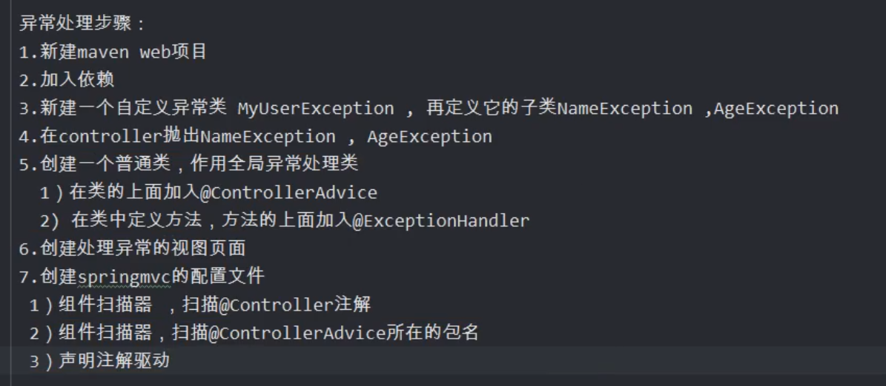
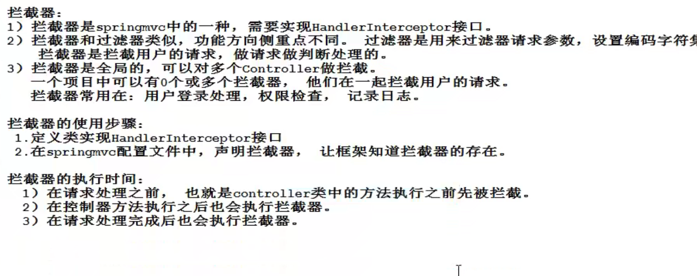
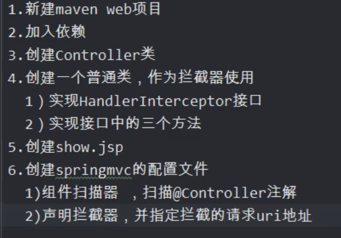
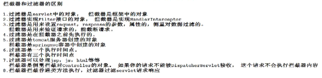

# SpringMVC

## 1、创建项目

### 实现步骤

1. 新建web maven工程
2. 加入依赖
   1. spring-webmvc依赖
   2. jsp，servlet依赖
3. **在web.xml中注册springmvc框架的核心对象DispatchServlet**
   1. DispatchServlet叫中央调度器，是一个servlet，父类是继承HttpServlet
   2. DispatchServlet页叫做前端控制器
   3. DispatchServlet负责接收用户提交的请求，调用其他的控制器对象吗，请把请求的处理结果显示给用户
4. 创建一个发起请求的页面，index.jsp
5. 创建控制器类
   1. 在类的上面加入@Controller注解，创建对象，并放入到springmvc容器中
   2. 在类中的方法上面加入@RequestMapping注解
6. 创建一个作为结果的jsp，显示请求的处理结果
7. 创建springmvc的配置文件
   1. 声明组件扫描器，指定@Controller注解所在包名
   2. 声明视图解析器，帮助处理视图

### springmvc请求的处理流程

1. 发起some.do
2. tomcat（web.xml——url——pattern知道*.do的请求给DispatchServlet）
3. DispatchServlet（根据springmvc.xml配置知道some.do——doSome()）
4. DispatchServlet把some.do转发给了MyController.doSome()方法
5. 框架执行doSome()把得到ModelAndView进行处理，转发到show.jsp

### springmvc执行过程源代码分析

1. tomcat启动，创建容器的过程

   通过load-on-startup标签指定的1，创建DispatchServlet对象

## 2、注解

### @RequestMapping

### @RequestParam

### @ResponseBody

## 地址分类：

1. 绝对地址，带有协议名称的是绝对地址，http:///www.baidu.com

2. 相对地址，没有协议开头的，例如user/some.do。相对地址不能独立使用，必须有一个参考地址。通过参考地址+相对地址本身才能指定资源。

3. 参考地址，在页面中，访问地址不加“/”

   

## SSM

ssm整合：

1. 第一个容器SpringMVC容器，管理Controller控制器对象的。
2. 第二个容器Spring容器，管理Service，Dao，工具类对象的。

把使用的对象交给合适的容器创建，管理。把Controller还有web开发的相关的对象交给SpringMVC容器，这些web用的对象写在springmvc配置文件中

service，doa对象定义在spring的配置文件中，让spring管理这些对象。

springmvc容器和spring容器的子容器，类似java中的继承。子可以访问父的内容

### 步骤：

1. 创建数据库，id使用自增

2. 新建maven web项目

   加入依赖：springmvc，spring，mybatis三个框架的依赖，jackson依赖，mysql驱动，druid连接池，jsp，servlet依赖

3. 写web.xml

   1. 注册DispatchServlet：

      目的：

      1. 创建springmvc容器对象，才能创建Controller类对象
      2. 创建的是Servlet，才能接收用户的请求

   2. 注册spring的监听器：ContextLoaderListener，目的：创建spring的容器对象，才能创建service，dao等对象

   3. 注册字符集过滤器，解决post请求乱码问题

4. 创建包，Controller包，service，dao，实体类包名创建好

5. 写springmvc，spring，mybatis的配置文件

   1. springmvc配置文件
   2. spring配置文件
   3. mybatis主配置文件
   4. 数据库的属性配置文件

6. 写代码，dao接口和mapper文件，service和实现类，controller，实体类

7. 写jsp页面

## 异常处理

步骤：

## 拦截器

**步骤：**

过滤器和拦截器的区别：

