# 计算机网络

##  第一章、概述

###  概念、功能、组成、分类

####  概念

**计算机网络**:是一个将分散的、具有独立功能的**计算机系统**，通过**通信设备**与**线路**连接起来，由功能完善的**软件**实现**资源共享**和**信息传递**的系统。

计算机网络是互连的、自治的计算机集合。

互连：互相连通

自治：无主从关系

#### 功能

1. 数据通信
2. 资源共享
3. 分布式处理
4. 提高可靠性
5. 负载均衡

#### 组成

1. 组成部分：硬件、软件、协议
2. 工作方式：
   1. 边缘部分，用户直接使用：C/S方式、P2P方式
   2. 核心部分：为边缘部分服务
3. 功能组成
   1. 通信子网：实现**数据通信**
   2. 资源子网：实现**资源共享/数据处理**

*传输层相当于接口*

#### 分类

1. 按分布范围：广域网（交换技术），城域网，局域网，个人区域网
2. 按使用者分：公用网，专用网
3. 按交换技术分：电路交换，报文交换，分组交换
4. 按拓扑结构分：总线型，星型，环型，网状型（常用于广域网）
5. 按传输技术分：广播式网络（共享公共通信信道），点对点网络（使用**分组存储转发**和**路由选择机制**）

### 性能指标

速率

吞吐量

带宽

时延：

发送时延 = 数据帧长度 / 发送速率（信道带宽）

传播时延 = 信道长度 / 电磁波在信道上的传播速率

时延带宽积 = 传播时延 * 带宽

又称以比特为单位的链路长度

往返时延RTT：从发送方发送数据开始，到发送方收到接收方的确认（接收方收到数据后立即发送确认），总共经历的时延。

利用率：信道利用率，网络利用率（过高会产生非常大的时延）

###  计算机网络体系结构

####  协议和划分层次

网络协议三要素：

1. 语法
2. 语义
3. 同步

分层结构的优点：

1. 各层之间是独立的
2. 灵活性好
3. 结构上可分割开
4. 易于实现和维护
5. 能促进标准化工作

####  OSI参考模型

七层结构（自下而上）：1.物理层、2.数据链路层、3.网络层、4.运输层、5.会话层、6.表示层、7.应用层。（顺口溜：物联网叔会使用）

1-3 为通信子网，5-7为资源子网

应用层：

应用层的任务是**通过应用进程间的交互来完成特定网络应用**。应用层协议的定义式**应用进程间通信和交互的规则**(这里**进程**是指主机中**正在运行的程序**)。

表示层：

用于处理两个通信系统中交换信息的表示方式。

功能一：数据格式交换

功能二：数据加密解密

功能三：数据压缩和恢复

会话层：

向表示层实体/用户进程提供**建立连接**并在连接上**有序**地传输数据。

功能一：建立、管理、终止会话

功能二：使用校验点可使会话在通信失效时从**校验点/同步点**继续恢复通信，实现数据同步。

传输层：

负责主机中**两个进程**的通信，即**端到端**的通信。传输单位是**报文段或用户数据报**。

功能一：可靠传输、不可靠传输

功能二：差错控制

功能三：流量控制

功能四：复用分用

- 复用：多个应用层进程可同时使用下面运输层的服务
- 分用：运输层把收到的信息分别交付给上面应用层中相应的进程。

网络层：

主要任务是把**分组**从源端传到目的端，为分组交换网上的不同主机提供通信服务。网络层传输单位是**数据报**。

1. 功能一：路由选择

2. 功能二：流量控制

3. 功能三：差错控制

4. 功能四：拥塞控制

数据链路层：

主要任务是把网络层传下来的数据报**组装成帧**

数据链路层/链路层的传输单位是**帧**

功能：

1. 成帧（定义帧的开始和结束）
2. 差错控制
3. 流量控制
4. 访问（接入）控制——控制对信道的访问

物理层：

在**物理媒体**上实现比特流的**透明传输**

传输单位是**比特**

功能：

1. 定义接口特性
2. 定义传输模式
3. 定义传输速率
4. 比特同步
5. 比特编码

#### TCP/IP参考模型

体系结构（自顶向下）：

1. 应用层（各种应用层协议，如：DNS，HTTP，SMTP）
2. 运输层（TCP或UDP）
3. 网际层IP
4. 链路层（网络接口层）

##  第二章、物理层

物理层的主要任务：确定与传输媒体接口有关的一些特性。

- 物理特性：定义物理连接的特性，规定物理连接时所使用的的规格、接口形状、**引线数目**、引脚数量和排列情况。
- 电气特性：规定传输二进制位时，线路上信号的**电压范围**、阻抗匹配、传输**速率**和**距离**限制等
- 功能特性：指明某条线上出现的某一**电平表示何种意义**，接口部件的信号线的用途。
- 规程特性：定义各条物理线路的工作**规程和时序**关系

###  数据通信的基础知识

一个数据通信系统可分为三大部分：**源系统**（或**发送端、发送方**）、**传输系统**（或**传输网络**）和**目的系统**（或**接收端、接收方**）

源系统包括：

- 源点
- 发送器

目的系统包括：

- 接收器
- 终点

#### 常用术语：

通信的目的是**传递消息**

**数据**：运送消息的实体

**信号**：数据的电气/电磁的表现，是数据在传输过程中的**存在形式**

- 数字信号：代表消息的参数取值是离散的。
- 模拟信号：代表消息的参数取值是连续的。

**信源**：产生和发送数据的源头。

**信宿**：接收数据的终点。

**信道**：信号的传输媒介。一般用来表示向某一个方向传送信息的介质，因此一条通信线路往往包含一条发送信道和一条接收信道。

#### 三种通信方式：

1. 单工通信：只有一个方向的通信而没有反方向的交互，仅需要**一条**信道。
2. 半双工通信：通信双方都可以发送或接收信息，但任何一方都不能同时发送和接收，需要**两条**信道。
3. 全双工通信：通信双方可以同时发送和接收信息，也需要**两条**信道。

####  两种数据传输方式

串行传输：速度慢、费用低、适合远距离

并行传输：速度快、费用高、适合近距离（用于计算机内部数据传输）

####  码元、波特、速率、带宽

码元传输速率（1s传输多少个码元）

信息传输速率（1s传输多少个比特）

关系：若一个码元携带n bit的信息量，则M Baud的码元传输速率所对应的信息传输速率为M * b bit/s

####  奈氏准则和香农定理

影响失真程度的因素：

1. 码元传输速率
2. 信号传输距离
3. 噪声干扰
4. 传输媒体质量

**信道带宽**是信道能通过的**最高频率和最低频率之差**

码间串扰(失真的一种)：**接收端**收到的信号波形**失去了码元之间清晰界限**的现象。如：

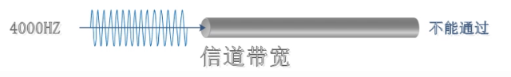

**奈氏准则**：在理想低通（无噪声，带宽受限）条件下，为了避免码间串扰，极限码元传输速率为2W Baud，W是信道带宽，单位是Hz。

1. 在任何信道中，码元传输的速率是有上限的。若传输速率超过此上限，就会出现严重的码间串扰问题，使接收端对码元的完全正确识别成为不可能。
2. 信道的**频带越宽**（即能通过的信号高频分量越多），就可以用更高的速率进行码元的有效传输。
3. 奈氏准则给出了码元传输速率的限制，但并没有对信息传输速率给出限制。
4. 由于码元的传输速率受奈氏准则的制约，所以要提高数据的传输速率，就必须设法使每个码元能携带更多个比特的信息量,这就需要采用多元制的调制方法。

噪声存在于所有的电子设备和通信信道中。由于噪声随机产生，它的瞬时值有时会很大，因此噪声会使接收端对码元的判决产生错误。但是噪声的影响是相对的，若信号较强，那么噪声影响相对较小。因此，信噪比就很重要。

**信噪比** = 信号的平均功率 / 噪声的平均功率，常记为S/N，并用分贝（dB）作为度量单位，即：

**香农定理**：在带宽受限且有噪声的信道中，为了不产生误差，信息的数据传输速率有上限值。

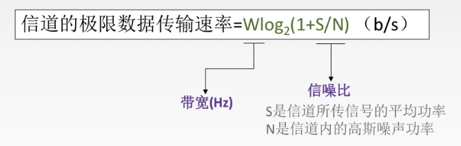

1. 信道的带宽或信道中的信噪比越大，则信息的极限传输速率就越高。
2. 对一定的传输带宽和一定的信噪比，信息传输速率的上限就确定了。
3. 只要信息的传输速率低于信道的极限传输速率，就一定能找到某种方法来实现无差错的传输。
4. 香农定理得出的为极限信息传输速率，实际信道能达到的传输速率要比它低不少。
5. 从香农定理可以看出，若信道带宽w或信噪比S/N没有上限（不可能)，那么信道的极限信息传输速率也就没有上限。

奈氏准则和香农定理的对比;

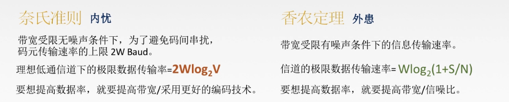

香农定理表征的是一个信道的性能，也就是在信噪比为S/N的信道上，无论采用何种编码方式，能达到的极限传输速率；而nyquist准则则是表征一种编码方式的性能，即在理想的带限信道下，这种编码方式的数据传输率；

####  基带型号与宽带信号

信道：信号的传输媒介。一般用来表示向某一个方向传送信息的介质，因此一条通信线路往往包含一条发送信道和一条接收信道。

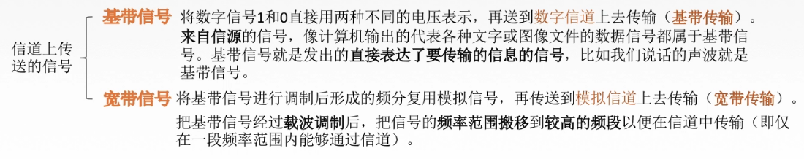

在传输距离较**近**时，计算机网络采用**基带传输**方式(近距离衰减小，从而信号内容不易发生变化)
在传输距离较**远**时，计算机网络采用**宽带传输**方式(远距离衰减大，即使信号变化大也能最后过滤出来基带信号)

####  编码与调制

数据——**编码**——>数字信号

数据——**调制**——>模拟信号

相互转换：

曼彻斯特编码：前高后低是1，前低后高是0
数据传输速率只有调制速率的1/2

查分曼彻斯特编码：同1异0
（作用是下一个码元）

在计算机应用中，能达到最高保真水平的就是PCM（脉码调制）编码。主要包括三步：抽样、量化、编码。

传输介质是数据传输系统中在发送设备和接受设备之间的物理通路。（传输媒体不是物理层）

### 导向性传输介质

1. 双绞线
2. 同轴电缆
3. 光纤

光纤的特点：

1. 传输损耗小，中继距离长，对远距离传输特别经济
2. 抗雷电和电磁干扰性能好
3. 无串音干扰，保密性好，也不容易被窃听或截取数据
4. 体积小，重量轻

### 非导向性传输介质

1. 无线电波(向所有方向传播)：较强的穿透能力
2. 微波(固定方向)
   1. 地面微博接力通信
   2. 卫星通信
3. 红外线、激光(固定方向)：把要传输的信号分别转换为各自的信号格式

### 中继器

功能：对信号进行再生和还原，对衰减信号进行放大，保持与原数据相同，以增加信号传输距离，延长网络的长度。

### 5-4-3规则。

## 第三章、数据链路层

### 基本概念

结点：主机、路由器
链路：网络中两个结点间的物理通道，链路的传输介质主要有双绞线、光纤和微波。分为有限链路、无线链路。

数据链路：网络中两个结点间的逻辑通道，把实现控制数据传输协议的硬件和软件加到链路上就构成数据链路。

帧：链路层的协议数据单元，封装网络层数据报。

数据链路层：负责通过一条链路从一个结点向另一个物理链路直接相连的相邻结点传送数据报。

功能：

1. 为网络层提供服务
2. 链路管理。
3. 组帧
4. 流量控制
5. 差错控制（帧错/位错）

三个基本问题：

1. 封装成帧
2. 透明传输
3. 差错控制

### 组帧

封装成帧：就是在一段数据的前后部分添加首部和尾部。
首部和尾部的作用：帧定界。
帧同步：接收方应当能从接收到的二进制比特流中区分出帧的起始和终止。

组帧的方法：

1. 字符计数法
2. 字符填充法
3. 零比特填充法
4. 违规编码法

#### 透明传输

### 差错

由噪声引起。

全局性：由于线路本身电气特性所产生的随机噪声（热噪声），是信道固有的，随机存在的。
解决方法：提高信噪比或避免干扰（对传感器下手）

局部性：外界特定的短暂原因所造成的冲击噪声，是产生差错的主要原因
解决方法：利用编码技术来解决

差错：

1. 位错：比特位出错，1变成0，0变成1
2. 帧错：
   1. 丢失
   2. 重复
   3. 失序

####  检错编码

1. 奇偶校验码
2. CRC循环冗余码（最终发送的数据：要发送的数据 + 帧检验序列FCS）

#### 纠错编码

海明码：发现双比特错，纠正单比特错

### 流量控制和可靠传输机制

#### 流量控制的方法

1. 停止-等待协议
2. 滑动窗口协议
   1. 后退N帧协议（GBN）
   2. 选择重传协议（SR）

#### 停止等待协议

为什么要有停止-等待协议？

1. 除了比特出差错，底层信道还会出现丢包问题。
   丢包：物理线路故障、设备故障、病毒攻击、路由信息错误等原因，会导致数据包的丢失。
2. 为了实现流量控制

应用情况：

1. 无差错情况：
   一发送一确认

2. 有差错情况：
   1. 数据帧丢失或检测到帧出错：当发送端等待确认消息时长超出超时计时器设定时长，则重新发送。
   2. ACK（确认帧）丢失：超时重传
   3. ACK迟到：收到重复的帧，则丢弃重复帧。

缺点：信道利用率低

信道利用率 = （L / C）/ T
（T：发送周期，L：T内发送L比特数据，C：发送方数据传输率）
信道吞吐率 = 信道利用率 * 发送方的发送速率

#### 后退N帧协议(GBN)

发送方必须响应的三件事：

1. 上层的调用
2. 收到了一个ACK（累积确认）
3. 超时事件

接收方需要做的事情：

1. 如果正确收到n号帧，并且按序，那么接收方为n帧发送一个ACK，并将该帧中的数据部分交付给上层。
2. 其余情况都丢弃帧（如，收到1245帧，丢弃45帧），并为最近按序接收的帧重新发送ACK。接收方无需缓存任何失序帧，只需要一个维护信息：下一个按序接收的帧序号。

重点总结：

1. 累积确认
2. 接收方只按顺序接受帧，其余帧丢弃
3. 确认序列号最大的、按序到达的帧
4. 发送窗口最大为2^n - 1，接收窗口大小为1

缺点：批量重传

#### 选择重传协议(SR)

发送方必须响应的三件事：

1. 上层的调用
2. 收到了一个ACK
3. 超时事件

接收方需要做的事：

1. 确认正确接收的帧。缓存失序的帧，并返回发送方一个该帧的确认帧，直到所有帧皆被收到为止，此时才将一批帧按序交付给上层，然后向前移动滑动窗口。

滑动窗口长度：

1. 发送窗口最好等于接收窗口（大了会溢出，小了没意义）为2^(n - 1)

重点总结：

1. 对数据帧逐一确认，收一个确认一个
2. 只重传出错帧
3. 接收方有缓存
4. W(Tmax) = W(Rmax) = 2^(n - 1)

###  介质访问控制

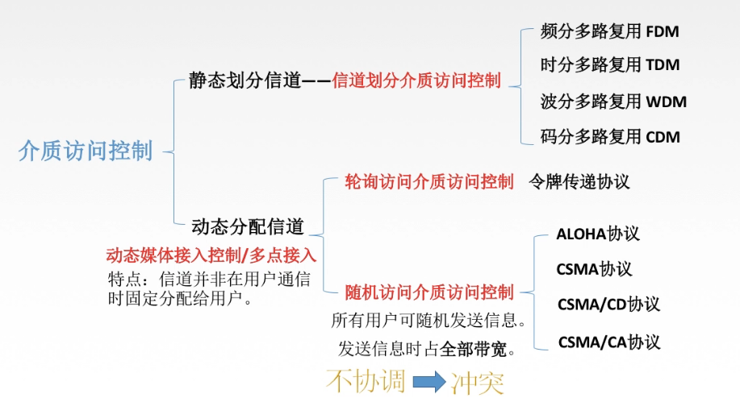

#### 信道划分介质访问控制

将使用的介质的每个设备与来自同一信道上的其他设备的通信隔离开，把时域和频域资源合理地分配给网络上的设备

多路复用技术：把多个信号组合在一条物理信道上进行传输，使得多个计算机或终端设备共享信道资源，提高信道利用率

####  轮询访问介质访问控制

#####  令牌传递协议

####  ALOHA协议

纯ALOHA协议：不监听信道，不按时间槽发送，随机重发。（想法就发）

时隙ALOHA协议的思想：把时间分成若干相同的时间片，所有用户在时间片开始时刻同步接入网络信道，若发生冲突，则必须等到下一个时间片开始时刻再发送。

**对比**：

1. 纯ALOHA比时隙ALOHA吞吐量更低，效率更低。
2. 纯ALOHA想发就发，时隙ALOHA只有在时间片段开始时才能发。

####  CSMA协议（载波监听多路访问协议）

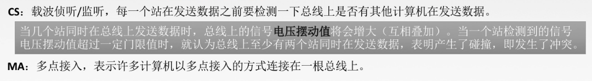

发送帧之前，监听信道。

三种CSMA：

1. 1-坚持CSMA
2. 非坚持CSMA
3. p-坚持CSMA

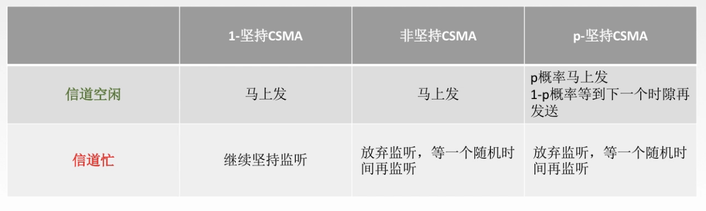

####  CSMA-CD协议

CD:碰撞**检测**（冲突检测），“边发送边监听”，适配器边发送数据边检测信道上信号电压的变化情况，以便判断自己在发送数据时其他站是否也在发送数据。（CD主要针对以太网）

**由于传播时延导致**

利用二进制指数规避算法：

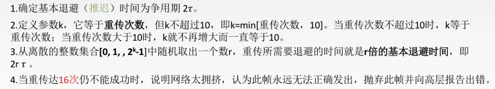

如果帧过短，则有可能在发送完毕之后才检测到发生碰撞。

解决方法：让帧的**传输时延**至少要**两倍**于信号在总线中的传播时延。（**τ是单程端到端传播时延**）

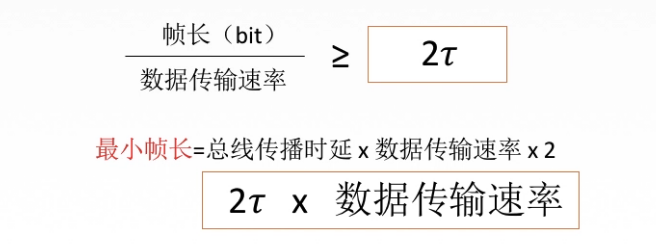

*以太网规定最短帧长为64B，凡是长度小于64B的都是由于冲突而异常终止的无效帧。*

####  CSMA-CA协议

CA：碰撞**避免**。（CA主要针对无线局域网）

工作原理：

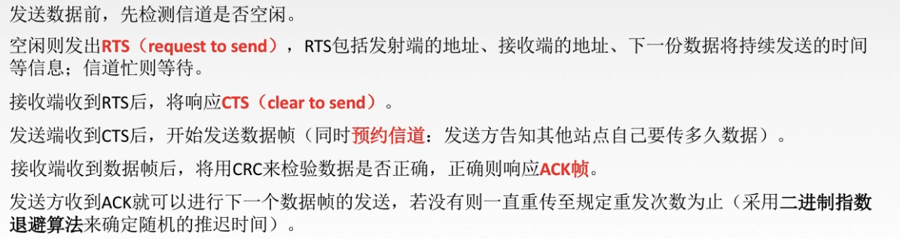

**CSMA-CA和CSMA-CD的区别：**

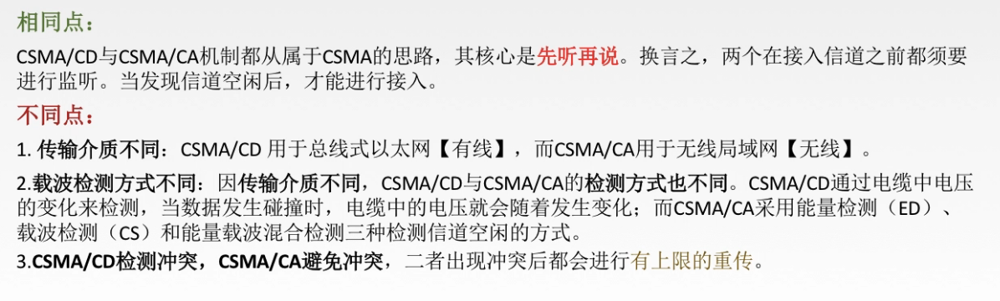

####  MAC协议总结

###  局域网

####  概念

局域网(Local Area Network):简称LAN，是指在**某一区域内**由多台计算机互联成的计算机组，使用广播信道。

特点：

1. 覆盖的地理范围较小，只在一个相对独立的局部范围内联，如一座或集中的建筑群内。
2. 使用专门铺设的传输介质（双绞线、同轴电缆）进行联网，数据传输速率高（10Mb/s~10Gb/s)。
3. 通信延迟时间短，误码率低，可靠性较高。
4. 各站为平等关系，共享传输信道。
5. 多采用分布式控制和广播式通信，能进行广播和组播。

决定局域网的主要要素为：**网络拓扑、传输介质和介质访问控制方法。**

局域网拓扑结构：

- 星型拓扑
- 总线型拓扑
- 环型拓扑
- 树型拓扑

介质访问控制方法：

1. CSMA-CD：常用于**总线型局域网**，也用于树型网络

2. 令牌总线：常用于**总线型局域网**，也用于树型网络。

   它是把总线型或树型网络中的各个工作站按一定顺序如按接口地址大小排列形成一个逻辑环。只有令牌持有者才能控制总线，才有发送信息的权力。

3. 令牌环：常用于**环型局域网**，也用于令牌环网

局域网的分类：

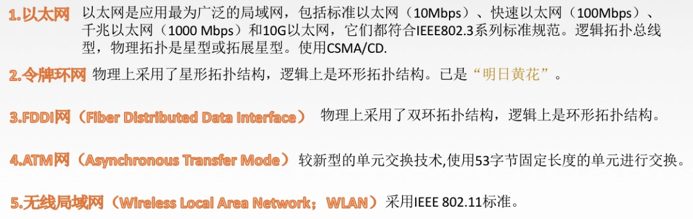

####  以太网

以太网的两个标准：

1. DIX Ethernet V2:第一个局域网产品（以太网）规约。
2. IEEE 802.3: IEEE 802委员会802.3工作组制定的第一个IEEE的以太网标准。（帧格式有一丢丢改动)

####  无线局域网

分类：

1. 有固定基础设施无线局域网
2. 无固定基础设施无线局域网的自组织网络

### 广域网

广域网的通信子网主要使用**分组交换**技术。广域网的通信子网可以利用公用分组交换网、卫星通信网和无线分组交换网，它将分布在不同地区的**局域网或计算机系统**互连起来，达到**资源共享**的目的。如因特网（Internet)是世界范围内最大的广域网。

####  PPP协议

点对点协议PPP(Point-to-Point Protocol）是目前使用最广泛的数据链路层协议，用户使用拨号电话接入因特网时一般都使用PPP协议。

采用全双工通信。

PPP协议应满足的要求：

- 简单
- 封装成帧
- 透明性
- 多种网络协议
- 多种类型链路
- 差错检测
- 检测连接状态
- 最大传送单元
- 网络层地址协商
- 数据压缩协商

三个组成：

1. 一个将IP数据报封装到串行链路（同步串行/异步串行）的方法。
2. 链路控制协议LCP：建立并维护数据链路连接。
3. 网络控制协议NCP：PPP可支持多种网络层协议，每个不同的网络层协议都要一个相应的NCP来配置，为网络层协议建立和配置逻辑连接。

####  HDLC协议

高级数据链路控制(High-Level Data Link Control或简称HDLC)，是一个在同步网上传输数据、**面向比特**的数据链路层协议，它是由国际标准化组织(ISO)根据IBM公司的SDLC(SynchronousData Link Control)协议扩展开发而成的。

数据报文可透明传输，用于实现透明传输的“o比特插入法”易于硬件实现

采用全双工通信。

HDLC的站：

1. 主站：发送命令（包括数据信息）帧、接收响应帧，并负责对整个链路的控制系统的初启、流程的控制、差错检测或恢复等。
2. 从站：接收由主站发来的命令帧，向主站发送响应帧，并且配合主站参与差错恢复等链路控制。
3. 复合站：既能发送，又能接收命令帧和响应帧，并且负责整个链路的控制。

三种数据操作方式：

1. 正常响应方式
2. 异步平衡方式
3. 异步响应方式

PPP和HDLC协议的对比：

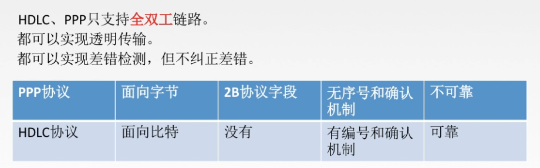

###  链路层设备

####  网桥

网桥根据**MAC帧的目的地址**对帧进行**转发**和**过滤**。当网桥收到一个帧时，并不向所有接口转发此帧，而是先检查此帧的目的MAC地址，然后再确定将该帧转发到哪一个接口，或者是把它丢弃（即过滤)

网桥的优点：

1. 过滤通信量，增大吞吐量
2. 扩大了物理范围
3. 提高了可靠性
4. 可互连不同物理层、不同MAC子层和不同速率的以太网。

网桥的分类：

- 透明网桥：“透明”指以太网上的站点并不知道所发送的帧将经过哪几个网桥，是一种即插即用设备——自学习。
- 源路由网桥：在发送帧时，把详细的最佳路由信息（路由最少/时间最短）放在帧的首部中。

####  交换机（多接口网桥）

- 直通式交换机
- 存储转发式交换机

####  冲突域和广播域

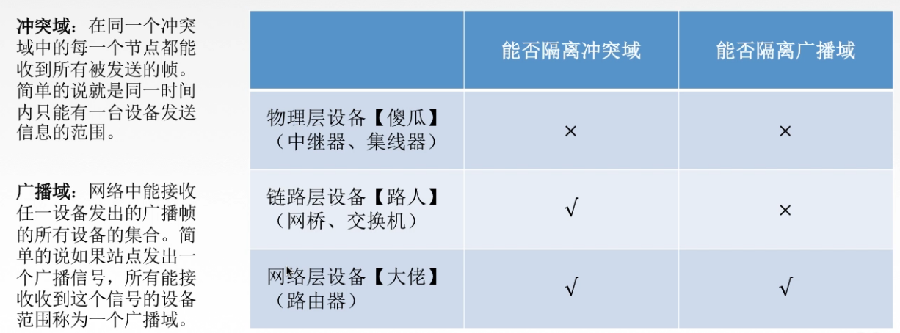

##  第四章、网络层

主要任务是把**分组**从源端传到目的端，为分组交换网上的不同主机提供通信服务。网络层传输单位是**数据报**。

功能：

1. 路由选择与分组转发
2. 异构网络互联
3. 拥塞控制
   1. 开环控制（静）
   2. 闭环控制（动）

###  数据交换方式

#### 电路交换

电路交换的阶段：

1. 建立连接（呼叫/电路建立）
2. 通信
3. 释放连接（拆除电路）

优点：

- 通信时延小
- 有序传输
- 没有冲突
- 实时性强

缺点：

- 建立连接时间长
- 线路独占，使用效率低
- 灵活性差
- 无差错控制能力

#### 报文交换

报文：源应用发送的信息整体。

优点：

- 无需建立连接
- 存储转发，动态分配路线
- 线路可靠性较高
- 线路利用率较高
- 多目标服务

缺点：

- 有存储转发时延
- 报文大小不定，需要网络节点有较大缓存空间

#### 分组交换

分组:把大的数据块分割成小的数据块。

优点：

- 无需建立连接
- 存储转发，动态分配路线
- 线路可靠性较高
- 线路利用率较高
- 相对于报文交换，存储管理更容易

缺点：

- 有存储转发时延
- 需要传输额外的信息量
- 乱序到目的主机时，要对分组排序重组

#### 三种数据交换方式总结

1. **报文交换**和**分组交换**都采用**存储转发**。
2. 传送数据量大，且传送时间远大于呼叫时间，选择**电路交换**。电路交换传输时延最小。
3. 从信道利用率看，**报文交换**和**分组交换**优于电路交换，其中**分组交换**时延更小。

#### 数据报方式和虚电路方式

**数据报方式**为网络层提供**无连接服务**。

**无连接服务**:不事先为分组的传输确定传输路径，每个分组独立确定传输路径，不同分组传输路径可能不同。

**每个分组携带源和目的地址。**

**路由器根据分组的目的地址转发分组**:基于路由协议/算法构建转发表;检索转发表;每个分组独立选路。

**虚电路方式**为网络层提供**连接服务**。

**虚电路**:一条源主机到目的主机类似于电路的路径（逻辑连接），路径上所有结点都要维持这条虚电路的建立，都维持一张虚电路表，每一项记录了一个打开的虚电路的信息。（**结合数据报方式和电路交换方式**）

通信过程：

1. 建立连接（虚电路建立）
2. 数据传输
3. 释放连接（虚电路释放）

连接服务:首先为分组的传输确定传输路径（建立连接），然后沿该路径（连接）传输系列分组，系列分组传输路径相同，传输结束后拆除连接。

**数据报和虚电路对比：**

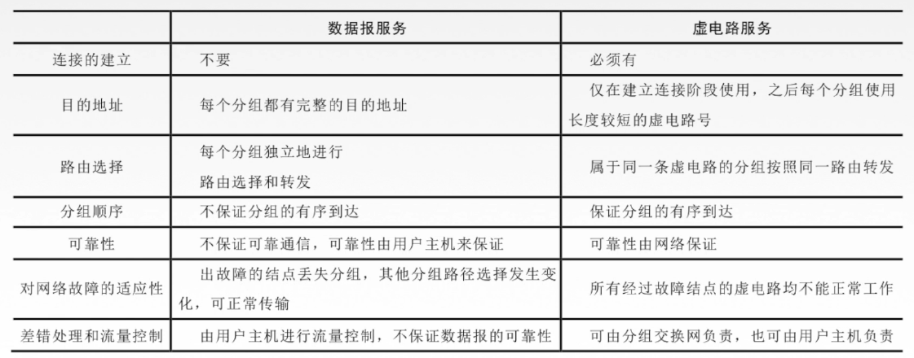

#### 计算题技巧

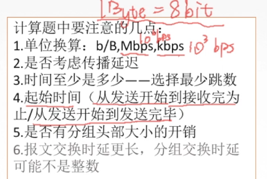

### 网际协议IP

格式：

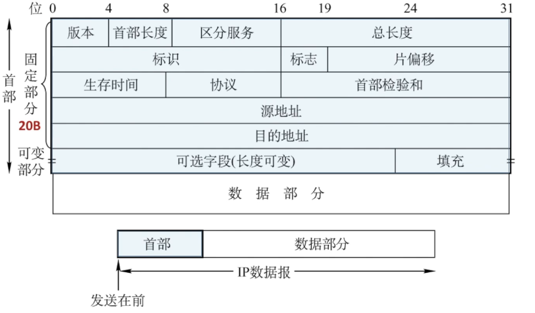

#### 分片

**最大传送单元MTU**：链路层数据帧可封装数据的上限。（以太网的MTU是1500字节）

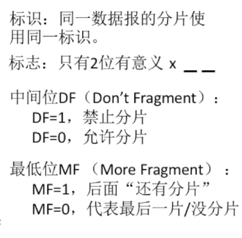

例题：

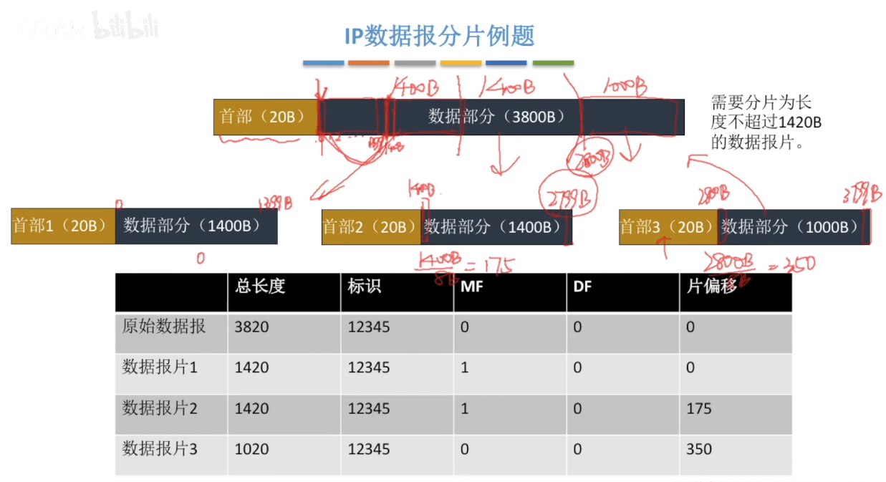

#### IPv4地址

分类：

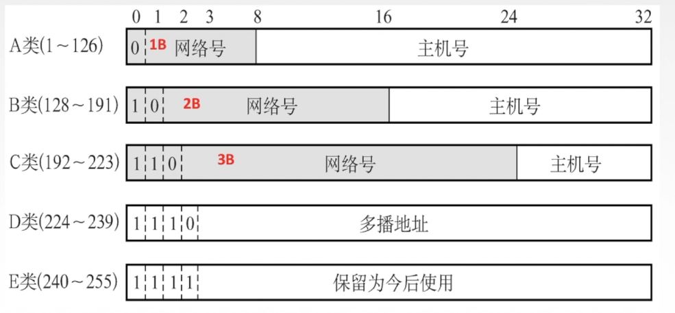

私有IP地址：

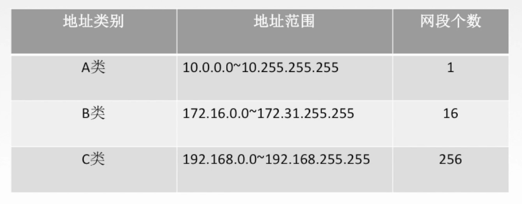

路由器对目的地址是私有IP地址的数据报一律不进行转发。

#### 网络地址转换NAT

网络地址转换NAT (Network Address Translation)：在**专用网**连接到**因特网**的路由器上安装NAT软件，安装了NAT软件的路由器叫**NAT路由器**，它至少有一个有效的**外部全球IP地址**。

#### 子网划分

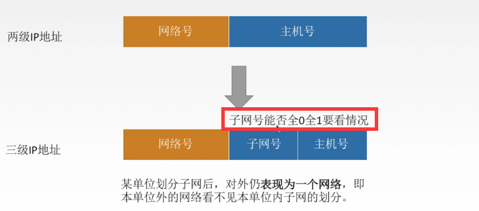

#### 无分类编址CIDR

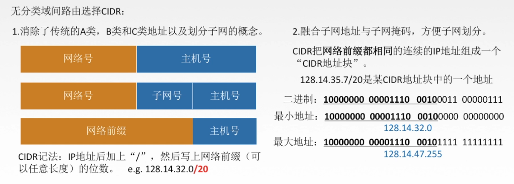

构成超网：缩短网络前缀

####  地址解析协议ARP

ARP协议是自动进行的

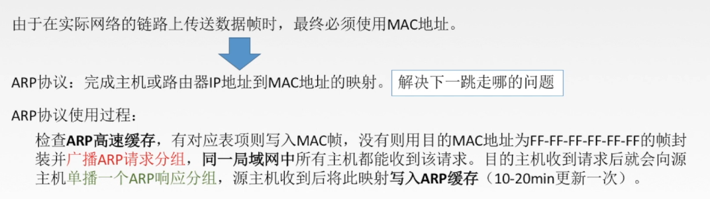

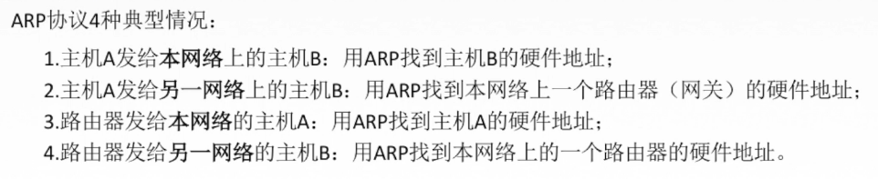

#### DHCP协议

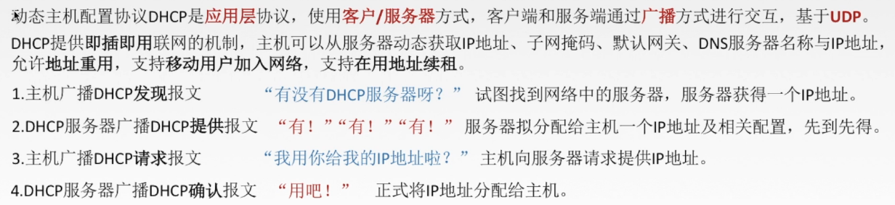

### 网际控制报文协议ICMP

分为两类：

1. ICMP差错报告报文
2. ICMP询问报文

#### ICMP差错报告报文

分类：

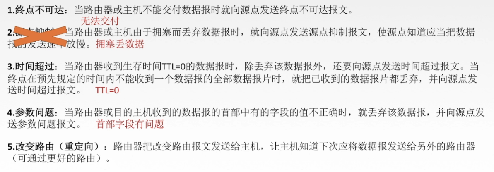

不应发送的情况：

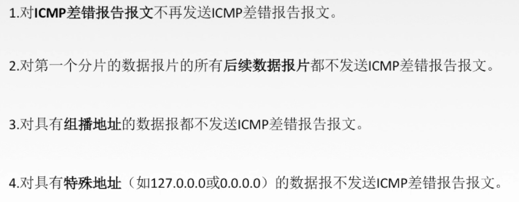

#### ICMP询问报文

分类：

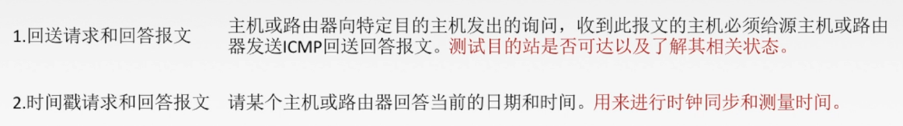

### IPv6

IPv6引进的变化：

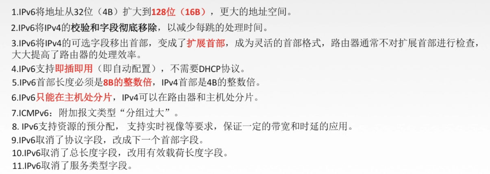

基本地址类型：

1. 单播：一对一通信，可做**源地址 + 目的地址**
2. 多播：一对多通信，可做**目的地址**
3. 任播：一对多中的一个通信，可做**目的地址**

### 路由选择协议

路由算法的分类：

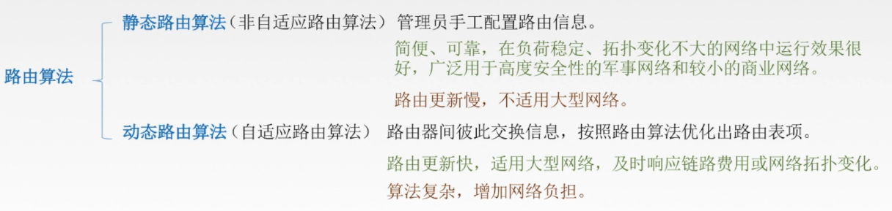

#### 分层次的路由选择协议

**自治系统AS**:在单一的技术管理下的一组路由器，而这些路由器使用一种AS内部的路由选择协议和共同的度量以确定分组在该AS内的路由，同时还使用一种AS之间的路由协议以确定在AS之间的路由。
一个AS内的所有网络都属于一个行政单位来管辖，一个自治系统的所有路由器在本自治系统内都必须连通。

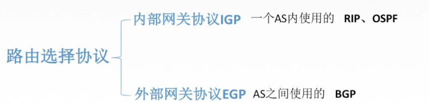

#### RIP协议

RIP是一种分布式的基于**距离向量**的路由选择协议，是因特网的协议标准，最大优点是**简单**。
RIP协议要求网络中每一个路由器都维护**从它自己到其他每一个目的网络的唯一最佳距离记录**（即一组距离）。

**距离**:通常为“跳数”，即从源端口到目的端口所经过的路由器个数，经过一个路由器跳数+1。特别的，从一路由器到直接连接的网络距离为1。RIP允许一条路由最多只能包含15个路由器，因此**距离为16表示网络不可达**。

RIP协议特点：

1. 仅和相邻路由器交换信息
2. 路由器交换的信息是**当前本路由所知道的全部信息，即自己现在的路由表**
3. **按照固定的时间间隔**交换路由信息

##### 距离向量算法

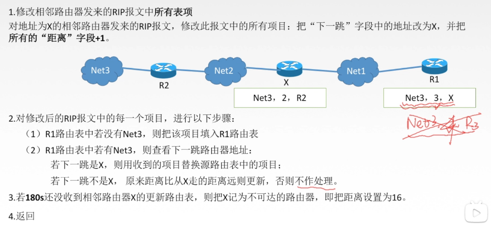

例题：

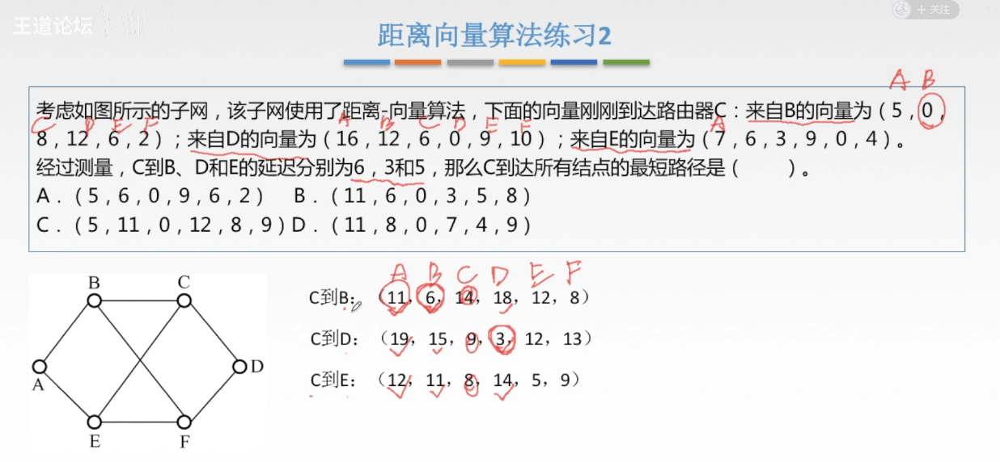

#### 内部网关协议OSPF

最主要特征：**链路状态协议**

#### 外部网关协议BGP

BGP是一个外部网关协议，在不同的自治系统之间交换路由信息，由于网络环境复杂，需要保证可靠传输，所以采用TCP。

#### 三种协议的比较

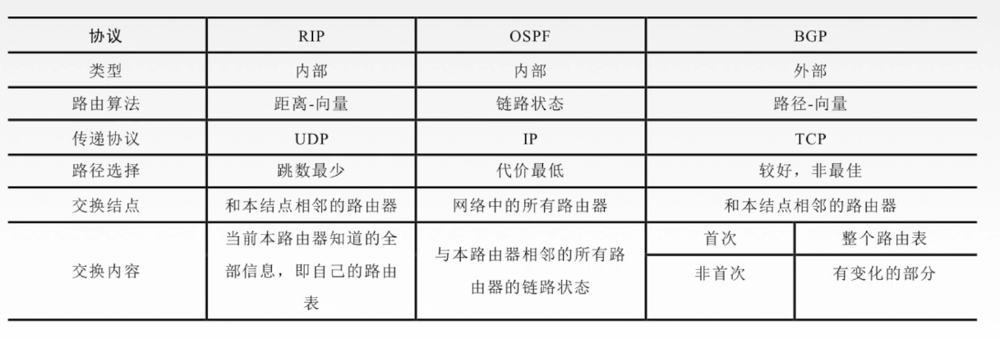

### IP多播

#### 网际组管理协议ICMP

让**连接在本地局域网**上的多播路由器知道**本局域网**上是否有主机（严格讲，是主机上的某个进程）参加或退出了某个多播组

#### 多播路由选择协议

方法：

1. 洪泛与剪除
2. 隧道技术
3. 基于核心的发现技术

### 移动IP

移动lP技术是移动结点(计算机/服务器等)以**固定的网络IP地址**，实现跨越不同网段的**漫游**功能，并保证了基于网络lP的网络权限在漫游过程中不发生任何改变。

- **移动结点**：具有永久IP地址的移动设备。

- **归属代理（本地代理）**：一个移动结点的拥有就“居所”称为归属网络，在归属网络中代表移动节点执行移动管理功能的实体叫做归属代理。

- **外部代理（外地代理）**：在外部网络中帮助移动节点完成移动管理功能的实体称为外部代理。

- **永久地址（归属地址/主地址)**：移动站点在归属网络中的原始地址。

- **转交地址（辅地址)**：移动站点在外部网络使用的临时地址。

### 网络层设备

三层设备的区别：

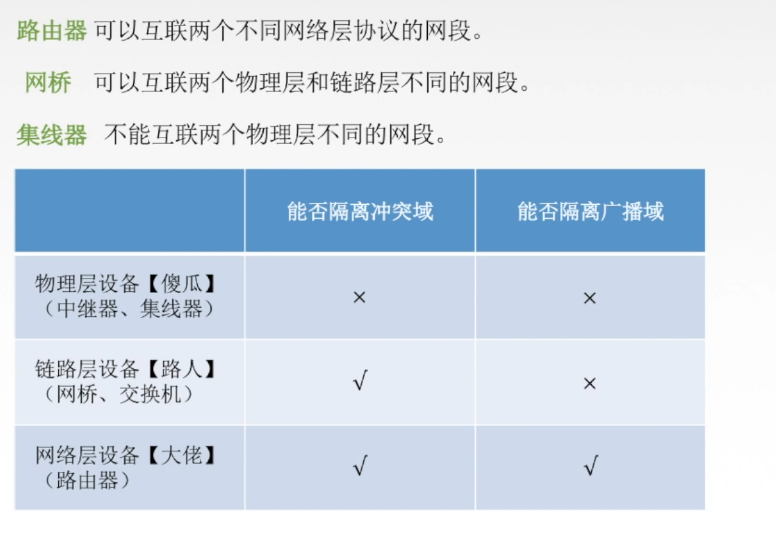

##  第五章、运输层

### 概述

**运输层提供应用程序间的逻辑通信**，**以及对收到的报文进行差错检测**

运输协议：

- 面向连接的TCP（传输控制协议）
- 无连接的UDP（用户数据报协议）

复用：在发送方不同的应用进程都可以使用同一个运输层协议传送数据（需要加上适当的首部）

分用：接收方的运输层在剥去报文的首部后能够把这些数据正确交付目的的应用进程

### UDP协议

特点：

1. UDP是**无连接**的，减少开销和发送数据之前的时延
2. UDP使用最大努力交付，即**不保证可靠交付**
3. UDP是**面向报文**的，适合一次性传输少量数据的网络应用
4. UDP**无拥塞控制**，适合很多实时应用
5. UDP**支持一对一**、**一对多**、**多对一和多对多的交互通信**
6. UDP**首部开销小**，只有8个字节，比TCP的20个字节的首部要短

UDP校验

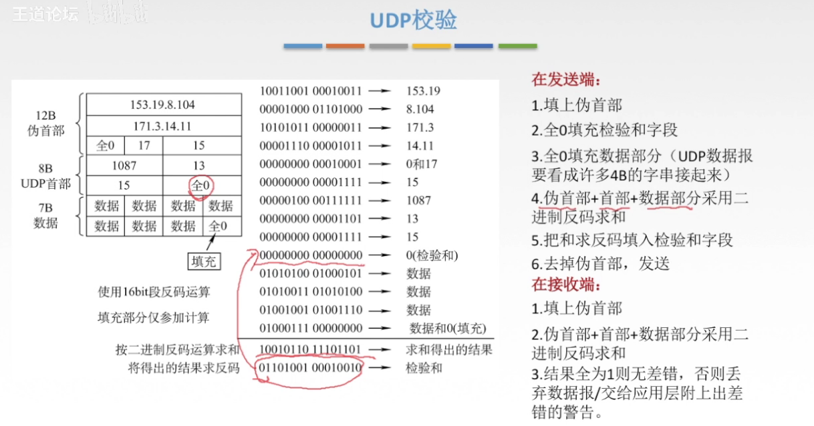

### TCP协议

特点：

1. TCP是面向连接（虚连接）的传输层协议
2. 每一条TCP连接只能有两个端点，每一条TCP连接只能是点对点
3. TCP提供可靠交付的服务，无差错、不丢失、不重复、按序到达
4. TCP提供全双工通信(两端设有发送缓存和接收缓存)
   1. 发送缓存：**准备发送的数据和已发送但尚未收到确认的数据**
   2. 接收缓存：**按序到达但尚未被接受应用程序读取的数据和不按序到达的数据**
5. TCP面向字节流

#### TCP连接管理

阶段：

1. 连接建立
2. 数据传送
3. 连接释放

#### TCP可靠传输

以字节为单位的滑动窗口

超时重传

#### TCP流量控制

让发送方的发送速率不要太快，要让接收方来得及接收

TCP利用**滑动窗口**机制实现流量控制。

在通信过程中，接收方根据自己**接收缓存的大小**，动态地调整发送方的发送窗口大小，即接收窗口rwnd(接收方设置确认报文段的**窗口字段**来将rwnd通知给发送方），发送方的**发送窗口取接收窗口rwnd和拥塞窗口cwnd的最小值**。

#### TCP拥塞控制

出现拥塞的条件: 对资源需求的总和 > 可用资源

算法：

- 慢开始
- 拥塞避免
- 快重传
- 快恢复

假定:

1. 数据单方向传送，而另一个方向只传送确认
2. 接收方总是有足够大的缓存空间，因而发送窗口大小取决于拥塞程度

发送窗口=Min{接收窗口rwnd，拥塞窗口cwnd}

接收窗口：接收方根据接受缓存设置的值，并告知给发送方，反映接收方容量。
拥塞窗口：发送方根据自己估算的网络拥塞程度而设置的窗口值，反映网络当前容量。

## 第六章、应用层

应用层对应用程序的通信提供服务

重要协议：

- FTP
- SMTP、POP3
- HTTP
- DNS

网络应用模型：

- 客户/服务器（C/S）模型
- P2P模型

#### 域名系统DNS

递归查询

迭代查询

#### 文件传送协议FTP

FTP是基于客户/服务器（C/S）的协议

FTP只用TCP实现可靠传输

#### 电子邮件

##### 简单邮件传送协议SMTP

SMTP规定了在两个相互通信的SMTP进程之间应如何交换信息。

负责发送邮件的SMTP进程就是SMTP客户，负责接收邮件的进程就是SMTP服务器。

SMTP规定了14条命令(几个字母）和21种应答信息（三位数字代码+简单文字说明)。

三个阶段：

1. 连接建立
2. 邮件传送
3. 连接释放

##### 邮件读取协议POP3和IMAP

##### 通用互联网邮件扩充MIME

#### 万维网

万维网WWW(World Wide Web）是一个大规模的、联机式的信息储藏所/资料空间，是无数个网络站点和网页的集合。

