# 数据结构


## 计算公式大全

### 常见时间复杂度

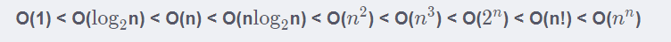

### 栈、队列和数组：

卡特兰数：通过入栈的不同元素总个数计算不同出栈序列的情况的个数

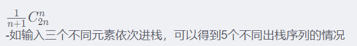

### 树与二叉树：

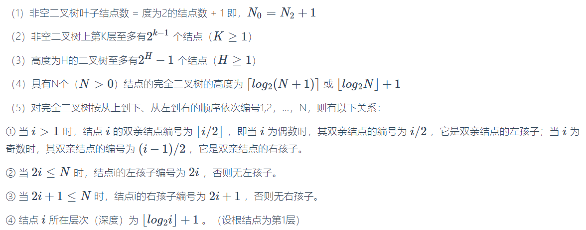

**节点数**：

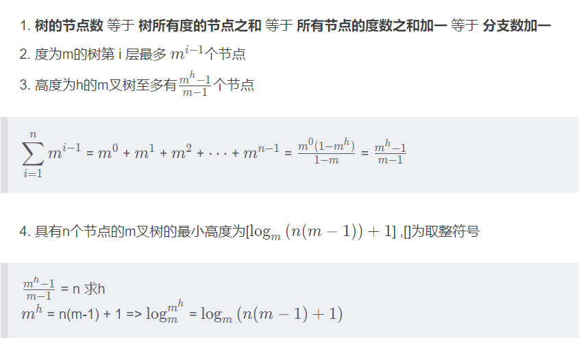


* 若度为m的哈夫曼树中，叶子结点个数为n，则非叶子结点的个数为**(n-1)/(m-1)**。(*王道185页第七题*)


## 第一章、绪论

### 1.1	数据结构的基本概念

数据：数据是**信息的载体**。

数据元素：数据元素是**数据的基本单位**。

数据对象：数据对象是**具有相同性质的数据元素的集合**。

数据类型：数据类型是**一个值的集合和定义在此集合上的一组操作的总称**。

- 原子类型：其值不可再分的数据类型。
- 结构类型：其值可以再分解为若干成分（分量）的数据类型。
- 抽象数据类型：抽象数据阻止及与之相关的操作。

数据结构：相互之间存在一种或多种**特定关系**的**数据元素**的**集合**。包含以下三方面的内容：

- **逻辑结构**
- **存储结构**
- **数据的运算**

#### 数据的三要素

##### 1. 数据的逻辑结构

逻辑结构与数据的存储无关，是独立于计算机的。

分为**线性结构**和**非线性结构**

- 线性结构：线性表
  - 一对多关系
- 非线性结构：集合、树、图
  - 树形结构：一对多
  - 图形结构或网状结构：多对多


##### 2. 数据的存储结构

存储结构是指数据结构在计算机中的表示（又称**映像**），也称**物理结构**。

- 包括**数据元素**的表示和**关系**的表示
- 依赖于计算机语言
- 主要存储结构：**顺序存储、链式存储、索引存储、散列存储**


顺序存储：

- 优点：可以实现随记存储，每个元素占用最少的存储空间。
- 缺点：只能使用相邻的一整块存储单元，可能产生较多的外部碎片。

链式存储：

- 优点：不会出现碎片现象，能充分利用所有存储单元。
- 缺点：每个元素因存储指针而占用额外的存储空间，且只能实现顺序存取。

索引存储：

- 优点：检索速度快。
- 缺点：附加的索引表额外占用存储空间。增加和删除数据时也要修改索引表，因而会花费较多的时间。

散列存储：

- 优点：检索、增加和删除节点的操作都很快。
- 缺点：若散列函数不好，则可能出现元素存储单元的冲突，而解决冲突会增加时间和空间的开销。


### 1.2	算法和算法评价


算法的重要特性：

1. 有穷性
2. 确定性
3. 可行性
4. 输入
5. 输出


设计算法需要考虑达到的目标：

1. 正确性
2. 可读性
3. 健壮性
4. 效率与低存储量需求

算法效率的度量：

- 时间复杂度
- 空间复杂度


常见时间复杂度大小：


空间复杂度：

算法的**原地工作**是指算法所需的辅助空间为常量，即O(1)


 ##  第二章、线性表

### 2.1	线性表的定义和基本操作

#### 线性表的定义

线性表是具有**相同数据类型**的n个数据元素的**有限**序列。

特点：

- 元素的个数有限
- 表中元素有先后次序
- 每个元素都是单个元素
- 每个元素的数据类型都相同，即每个元素占有相同大小的存储空间
- 仅讨论元素间的逻辑关系（具有抽象性）


### 2.2	线性表的顺序表示

#### 顺序表的定义

特点：

- 表中元素的**逻辑顺序**与其**物理顺序**相同
- **随机访问**，即通过首地址和元素序号可在时间O(1)内找到指定的元素。
- **存储密度高**，每个节点值存储数据元素。
- **逻辑**上相邻的元素**物理**上也相邻

注意：动态分配并不是链式存储，属于顺序存储结构，物理结构没有变化，依然是随记存取方式，只是分配的空间大小可以在运行时动态决定。


### 2.3	线性表的链式表示

#### 单链表的定义

特点：

- 解决顺序表需要大量连续存储单元的缺点
- 非随机存储


引入头结点的优点：

1. 由于第一个数据结点的位置被存放在头结点的指针域中，因此在链表的第一个位置上的操作和在表其他位置上的操作一致。
2. 无论链表是否为空，其头指针都指向头结点的非空指针

#### 单链表上基本操作的实现

1. 头插法：读入数据的顺序与生成的链表中的元素的顺序是相反的。
2. 尾插法
3. 按序号查找结点值
4. 按值查找表结点
5. 插入结点操作
6. 删除结点
7. 求表长

#### 双链表

为了解决无法访问前驱结点的问题

#### 循环链表

1. 循环单链表
2. 循环双链表

#### 静态链表


#### 顺序表和链表的比较

1. **存取（读写）方式**：顺序表可以顺序读取，也可以随记读取；链表只能从表头顺序读取元素
2. **逻辑结构与物理结构**
3. **查找、插入和删除操作**
4. **空间分配**


如何选取存储结构？

1. 基于**存储**的考虑
2. 基于**运算**的考虑
3. 基于**环境**的考虑


## 第三章、栈、队列和数组

### 3.1	栈

#### 栈的定义

栈是指允许在一端进行插入或删除操作的线性表。（**后进先出**）

栈的数学性质：n个不同的元素进栈，出栈元素不同排列的个数为（卡特兰数）：

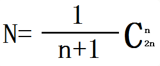

栈的基本操作：

- InitStack(&S)：初始化一个空栈
- SatckEmpty(S)：判断一个栈是否为空，若栈S为空则返回true，否则返回false
- Push(&S, x)：进栈，若栈S未满，则将x加入使之称为新栈顶
- Pop(&S, &x)：出栈，若栈S非空，则弹出栈顶元素，并用x返回
- GetTop(S, &x)：读栈顶元素，若栈S非空，则用x返回栈顶元素
- DestroyStack(&S)：销毁栈，并释放栈S占用的存储空间


#### 栈的顺序存储结构

1. 顺序栈的实现
2. 顺序栈的基本运算
3. 共享栈
   - 共享栈是**为了更有效地利用存储空间**，只有在整个存储空间被占满时才发生上溢


#### 栈的链式存储结构

优点：便于多个栈共享存储空间和提高其效率，且不存在栈满上溢的情况。


### 3.2	队列

#### 队列的定义

只允许在表的一端进行插入，另一端进行删除。（先进先出）

队列的基本操作：

- InitQueue(&Q)：初始化队列，构造一个空队列Q
- QueueEmpty(Q)：判断队列是否为空，为空返回true，反之返回false
- EnQueue(&Q, x)：入队，若Q未满，将x加入，使之成为新的队尾
- DeQueue(&Q, &x)：出队，若队列Q非空，则将队头元素赋值给x
- GetHead(Q, &x)：读队头元素，若队列Q非空，则将队头元素赋值给x


#### 队列的顺序存储结构

队列的顺序存储：

front指针指向队头元素，rear指针指向队尾元素的下一个位置

存储类型可描述为:

```c
#define MaxSize 50
typedef struct {
    ElemType data[MaxSize];
    int front, rear;
}SqQueue;
```


循环队列：

判断循环队列**队空**和**队满**的三种处理方式：

1. 牺牲一个单元来区分队空和队满

   队满条件：(Q.rear + 1)%Maxsize == Q.front

   队空的条件：Q.front == Q.rear

   队列中元素的个数：(Q.rear - Q.front + MaxSize) % MaxSize

2. 类型中增设表示元素的个数的数据成员

   队空的条件：Q.size == 0

   队满的条件：Q.size == MaxSize

   都有：Q.front == Q.rear

3. 类型中增设tag数据成员，以区分是队满还是队空

   队空条件：tag等于**0**时，若因**删除**导致Q.front == Q.rear，则为队空

   队满条件：tag等于**1**时，若因**插入**导致Q.front == Q.rear，则为队满


#### 队列的链式存储结构

存储类型可描述为:

```c
typedef struct LinkNode {
    ElemType data;
    struct LinkNode *next;
}LinkNode;
typedef struct {
    LinkNode *front, *rear;
}LinkQueue;
```


#### 双端队列

双端队列是指允许两端都可以进行入队和出队操作的队列。

- **输出**受限的双端队列：一端可以进行插入和删除，另一端只允许**插入**
- **输入**受限的双端队列：一端可以进行插入和删除，另一端只允许**删除**


### 3.3	栈和队列的应用

#### 栈在括号匹配中的应用

#### 栈在表达式求值中的应用

中缀表达式转化为后缀表达式

#### 栈在递归中的应用

#### 队列在层次遍历中的应用

#### 队列在计算机系统中的应用

例如：

1. 解决主机与外部设备之间速度不匹配的问题：主机与打印机
2. 解决由多用户引起的资源竞争问题：CPU资源竞争


### 3.4	数组与特殊矩阵

#### 特殊矩阵的压缩存储

压缩存储：为多个值相同的元素只分配一个存储空间，对零元素不分配存储空间。其目的是**节省存储空间。**

常见的特殊矩阵：

- 对称矩阵
- 上（下）三角矩阵
- 对角矩阵


##### 1. 对称矩阵

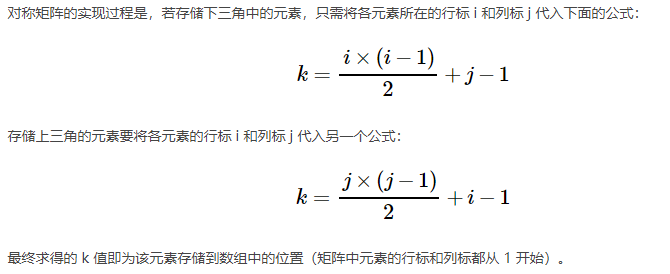


##### 2. 三角矩阵

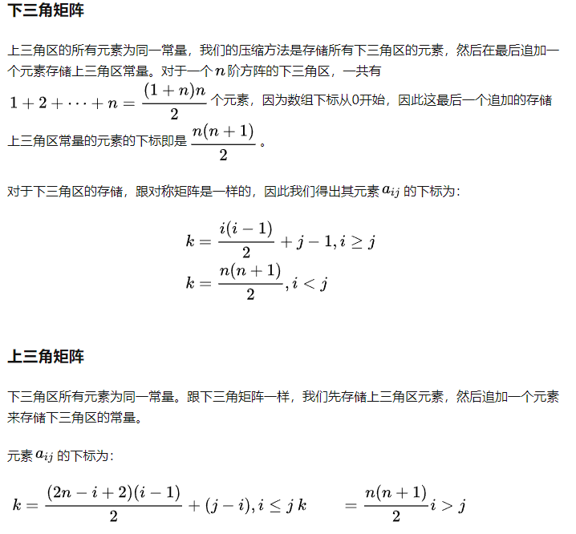


##### 3. 三对角矩阵

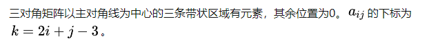


#### 稀疏矩阵

稀疏矩阵压缩存储后便失去了**随记存取特性**


## 第四章、串

**（大纲只要求掌握字符串模式匹配）**

### 4.1	KMP算法***.

[KPM算法讲解](https://zhuanlan.zhihu.com/p/83334559)

题型：

1. 求模式串的next值


## 第五章、树

### 5.1	树的基本概念

#### 树的定义

树是一种递归的数据结构

特点：

1. 树的根结点没有前驱，除根节点以外的所有结点有且只有一个前驱
2. 树中所有的结点可以有零个或多个后继
3. `n`个结点的树中有`n-1`条边


#### 基本术语

- 树中一个结点的孩子个数称为该结点的度
- 度大于0的结点称为分支结点，度为0的结点被称为叶子结点
- 深度：自顶向下
- 高度：自底向上


#### 树的基本性质


### 5.2	二叉树

#### 特殊的二叉树

1. 满二叉树：一棵高度为h，且含有`2^h-1`个结点的二叉树

2. 完全二叉树：当且仅当其每个结点都与高度为h的满二叉树中编号为1~n的结点一一对应时，称为完全二叉树。

   特点：

   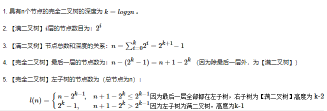

   

#### 二叉树的性质


#### 平衡二叉树

平衡二叉树：树上任一结点的左子树和右子树高度之差不超过1.

##### 调整最小不平衡子树

**只需调整最小不平衡子树，祖先树也会平衡**

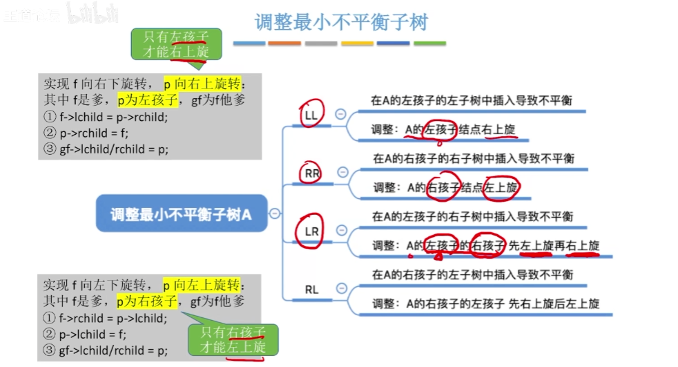

##### 最少结点分析

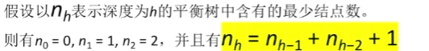

所以可以得到：

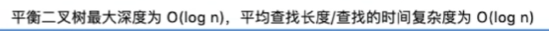


### 5.3	线索二叉树

#### 基本概念

引入线索二叉树的目的是：**为了加快查找结点前驱和后继的速度**

规定：

- 若无左子树，令lchild指向其前驱结点
- 若无右子树，令rchild指向其后继结点


### 5.4	树和森林

#### 树的存储结构

1. **双亲表示法**
2. 孩子表示法
3. 孩子兄弟表示法


#### 树、森林与二叉树的转换

树转换为二叉树的规则：**每个结点左指针指向它的第一个孩子，右指针指向它在树中的相邻右兄弟**


#### 树和森林的遍历

树的遍历：

1. 先根遍历：**先根后子树**，与这棵树相应的二叉树的**先序**序列相同
2. 后根遍历：**先子树后根**，与这棵树相应的二叉树的**中序**序列相同


### 5.5	哈夫曼树

哈夫曼树：在含有n个带权叶结点的二叉树中，其中**带权路径长度（WPL）的二叉树**。也称最优二叉树。

#### 带权路径长度

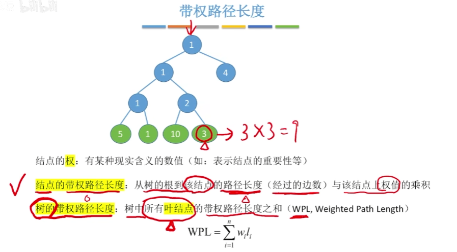


#### 哈夫曼树的构造

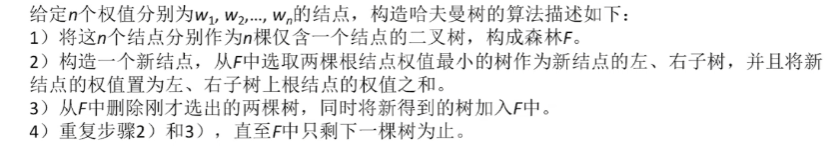

特点：

1. 每个初始结点最终都成了叶结点，且权值越小的结点到根结点的路径长度越大。
2. 哈夫曼树的结点总数为**2n-1**
3. 哈夫曼树中**不存在度为1的结点**
4. 哈夫曼树不唯一，但**WPL必然相同且为最优**


#### 哈夫曼编码

 **可变长度编码**：允许对不同字符用不等长的二进制位表示

若没有一个编码是另一个编码的前缀，则称这样的编码为**前缀编码**。


### 5.6	并查集

并查集：一种简单的集合表示。

并查集的结构：**双亲表示法存储的树**


两个核心操作：

1. 查找：查找两个元素是否属于同一个集合
2. 合并：如果两个元素不属于同一个集合，且所在的两个集合互不相交，则合并这两个集合


##  第六章、图

### 6.1 图的基本概念

1. 有向图

2. 无向图

3. 简单图

   1. 不存在重复的边
   2. 不存在顶点到自身的点

4. 完全图

   1. 对无向图：|E|的取值范围为**0~n(n - 1)/2**，n(n - 1)/2条边的无向图称为**完全图**。
   2. 对有向图：|E|的取值范围为**0~n(n - 1)**，n(n - 1)条边的无向图称为**有向完全图**。

5. 子图

6. 连通图：任意两个顶点都是连通的

   连通分量：**无向图**中的极大连通子图

7. 强连通：在**有向图**中，w到v和v到w之间都有路径，则这两个顶点强连通。

   强连通图：图中任何一对顶点都是强连通的。

   注意：**在无向图中讨论连通性，在有向图中讨论强连通性**

8. 生成树：包含图中全部顶点的一个极小连通子图。**若图中顶点数为n，则它的生成树含有n-1条边。**

9. 简单路径：在路径序列中，**顶点不重复出现**的路径称为简单路径。

   简单回路：**除第一个顶点和最后一个顶点外**，其余顶点不重复出现的回路称为简单回路。

10. 有向树：一个顶点的入度为0，其余顶点的入度均为1的有向树。

注意：

**极大**连通子图：是无向图的连通分量，要求该连通子图包含其所有的边。

**极小**连通子图：既要保持图连通又要使得边数最少的子图。


### 6.2	图的存储及基本操作

#### 邻接矩阵法

邻接矩阵存储：

- 用一个一维数组存储图中顶点的信息
- 用一个二维数组存储图中边的信息（即**各顶点之间的邻接关系**），被称为**邻接矩阵**


图的邻接矩阵存储结构定义：

```c
#define MaxVertexNum 100	// 顶点数目最大值
typedef char VertexType;	// 顶点的数据类型
typedef int EdgeType;	// 带权图中边上权值的数据类型
typedef struct {
    VertexType Vex[MaxVertexNum];	// 顶点表
    EdgeType Edge[MaxVertexNum][MaxVertexNum];	// 邻接矩阵，边表
    int vexnum,arcnum;	// 图的当前顶点数和弧数
}MGraph;
```

 

特点：

1. 无向图的邻接矩阵是对称矩阵。因此，在实际存储邻接矩阵时只需要存储上（或下）三角矩阵的元素。
2. 对于无向图，邻接矩阵的第i行非零元素的个数正好是顶点i的度
3. 对于有向图，领接矩阵的第i**行**非零元素的个数正好是顶点i的**出度**，第i**列**非零元素的个数正好是顶点i的**入度**


#### 邻接表法

领接表中存在两种节点：

- 顶点表结点
- 边表结点

特点：

1. 若G为无向图，则所需的存储空间为**O(|V|+2|E|)**；若G为有向图，则所需的存储空间为**O(|V|+|E|)**。前者的倍数2是由于**无向图中，每条边在领接表中出现了两次。**
2. 有向图的邻接表表示中，求一个给定顶点的**出度**只需计算其邻接表中结点的个数；但求其顶点的**入度**则需要遍历全部的邻接表。
3. 图的邻接表表示并**不唯一**


#### 十字链表

十字链表是**有向图**的一种链式存储结构。

- 弧结点
  - 尾域（tailvex）：指向**弧尾**
  - 首域（headvex）：指向**弧首**
  - 链域（hlink）：指向**弧头**相同的下一条弧
  - 链域（tlink）：指向**弧尾**相同的下一条弧
  - info域：指向该弧的**相关信息**
- 顶点结点
  - data：存放顶点相关的**数据信息**
  - firstin：指向该顶点为**弧头**的第一个弧结点
  - firstout：指向该顶点为**弧尾**的第一个弧结点

注意：图的十字链表表示是不唯一的，但一个十字链表表示确定一个图。


#### 邻接多重表

邻接多重表是**无向图**的另一种链式存储结构

- 弧结点：
  - mark标志域：标记该条边**是否被搜索过**
  - ivex、jvex：该边依附的两个顶点在图中的**位置**
  - ilink：指向下一条依附于顶点**ivex**的边
  - jlink：指向下一条依附于顶点**jvex**的边
  - info：指向和边相关的**各种信息**的指针域
- 顶点结点：
  - data：**相关信息**
  - firstedge：指向**第一条**依附于该顶点的边


### 6.3	图的遍历

#### 广度优先搜索

BFS算法借助一个辅助**队列**，可求解**非带权图的单源最短路径问题**

采用**邻接表**存储方式，时间复杂度为**O(|V|+|E|)**。

采用**邻接矩阵**存储方式，时间复杂度为**O(|V|²)**。

```c
/*
主要思路：利用辅助队列帮助访问，用数组visited保存每个顶点的访问信息。
1.	先将其实节点入队
2.	取出队列中第一个元素
3.	将该元素未被访问的子节点依次存入队列（利用先进先出的特性）
4.	重复2-3步，直到所有节点被访问完
*/
void BFS_MIN_Distance(Graph G, int u){
    // d[i]表示从u到i节点的最短路径
    for (i = 0; i < G.vexnum; ++i)	// 初始化路径长度
        d[i] = ∞;
    visited[u] = true;
    d[u] = 0;
    EnQueue(Q, u);
    while(!isEmpty(Q)){
        DeQueue(Q, u);	// 队头元素u出队
        for(w = FirstNeighbor(G, u); w >= 0; w = NextNeighbor(G, u, v)) {	
            if (!visited[w]){	// w为u尚未访问的邻接顶点
                visited[w] = true;	// 设已访问标记
                d[w] = d[u] + 1;	// 路径长度加1
                EnQueue(Q, w);	// 顶点w入队
            }
        }
    }
}
```


广度优先生成树：

- 由于邻接矩阵存储表示是唯一的，所以其广度优先生成树也是唯一的。同理，邻接表存储的广度优先生成树不唯一
- 对于**无向图**的广度优先搜索生成树，起点到其他顶点的路径是图中对应的**最短路径**。


#### 深度优先搜索

DFS算法通过递归实现，故而借助了递归工作**栈**

空间复杂度为**O(|V|)**

采用**邻接表**存储方式，时间复杂度为**O(|V|+|E|)**。

采用**邻接矩阵**存储方式，时间复杂度为**O(|V|²)**。

```c
bool visited[MAX_VERTEX_NUM];	// 访问标记数组
void DFSTraverse(Graph G) {	// 对图G进行深度优先遍历，如果图存在n个连通分量，DFSTraverse函数就会被递归调用n次
    for (v = 0; v < G.vexnum; v++) {
        visited[v] = FALSE;	// 初始化已访问标记数据
    }
    for (v = 0; v < G.vexnum; v++) {
        if (!visited[v]) {
            DFS(G, v);
        }
    }
}
void DFS(Graph G, int v) {
    visit(v);	// 访问顶点v
    visited[v] = TRUE;	// 将v的状态设为已访问
    for (w = FirstNeighbor(G, u); w >= 0; w = NextNeighbor(G, u, v)) {
        if (!visited[w]) {
            DFS(G, w);
        }
    }
}
```


深度优先生成树：

对**连通图**调用DFS才能产生**深度优先生成树**，否则产生的是深度优先生成森林


 


##  第七章、查找

### 7.1 基本概念

1. 查找
    - 查找成功
    - 查找失败

2. 查找表
    - 静态查找表：适合方法**顺序查找、折半查找、散列查找**
    - 动态查找表：适合方法**二叉排序树的查找、散列查找**

3. 关键字：数据元素中唯一标识该元素的某个数据项的值，使用基于关键字的查找，查找结果应该是唯一的。

4. 平均查找长度:

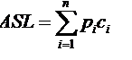
<br>

`n`是查找表的长度，`Pi`是查找第i个数据元素的概率，`Ci`是找到第i个数据元素所需进行的比较次数

<br>

### 7.2 顺序查找和折半查找

#### 顺序查找

又称**线性查找**

引入**哨兵**可以避免很多不必要的判断语句

查找成功时的平均长度：

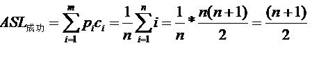

<br>

**ASL不成功 = n + 1**

**顺序查找优缺点：**
- 缺点：
    1. 当n较大事，平均查找长度较大，效率低

- 优点：
    1. 对数据元素的存储没有要求，顺序存储或链式存储。
    2. 对表中记录的有序性也没有要求，无论记录是否按关键字有序，均可应用。


有序表的顺序查找：

**ASL不成功 = n/2 + n/(n+1)**

<br/>

#### 折半查找

又称二分查找，仅适用于有序的顺序表

<br/>

判定树:

判定树是一棵**平衡二叉树**

折半查找法查找到给定值的比较次数最多**不会超过树的高度**

<br>

查找成功的平均查找长度为：

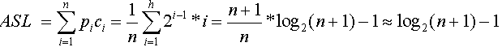
<br>

`h`为树的高度，元素个数为n时树高**h=[log₂(n+1)]**（**向上取整**）


<br/>

#### 分块查找
又称**索引顺序查找**，既有动态结构，又有快速查找

过程：
1. 在索引表中确定待查记录所在的块，可以顺序查找或折半查找索引表
2. 在块内顺序查找

<br/>

平均查找长度:

在等概率情况下，若在块内和索引表中均采用**顺序查找**，则平均查找长度为：
**ASL = (s² + 2s + n) / 2s**

<br>

若对**索引表**采用**折半查找**，则平均查找长度为；
**ASL = [log₂(b+1)] + (s+1)/2** (向上取整)


<br/>
<br/>
### 7.3 树型查找

#### 二叉排序树

二叉排序树是一种**动态树表**，其特点是**树的结构通常不是一次生成的，而是在查找过程中，当树中不存在关键字值等于给定值的结点时再进行插入**

重点：
1. 二叉排序树的插入
2. 二叉排序树的删除
3. 二叉排序树的效率：主要取决于树的高度
   - 若为平衡二叉树：平均查找长度为O(log₂n)
   - 若为单枝树，则平均查找长度为O(n)


<br/>

当有序表是**静态查找表**时，宜用**顺序表**作为其存储结构，而采用**二分查找**实现其查找操作；若有序表是**动态查找表**，则应选择**二叉排序树**作为其逻辑结构。

<br/>

#### 平衡二叉树


平衡二叉树的插入：
1. LL
2. RR
3. LR
4. RL


平衡二叉树的查找：

含有n个结点的平衡二叉树的最大深度为O(log₂n)，因此**平均查找长度为O(log₂n)**


<br>

#### 红黑树

红黑树的性质：
1. 每个结点或是红色，或是黑色
2. 根结点时黑色的
3. 叶结点（虚构的外部结点、NULL结点）都是黑色的
4. 不存在两个相邻的红结点（即红结点的父结点和子结点都是黑色的）
5. 对每个结点，从该结点到任一叶结点的简单路径上，所含黑结点的数量是相同的


结论：
1. 从根到叶结点的最长路径不大于最短路径的2倍
2. 有n个内部结点的红黑树的高度**h$\le$2log₂(n+1)**
3. 新插入红黑树中的结点初始着红色

注意：如果**插入和删除**操作比较**少**，**查找**操作比较**多**，采用**AVL树**比较合适，否则采用**红黑树**更合适。


<br>

### 7.4 B树和B+树

#### B树及其基本操作

B树，又称**多路平衡查找树**，B树中所有结点的孩子个数的最大值称为B树的阶

B树的性质：


<br>


1. B树的高度（磁盘存取的次数）
- B树中每个结点最多有m棵子树，m-1个关键字。**h$\ge log_m$(n+1)**
- **h$\le log_\lceil$$_m$$_/$$_2$$_\rceil$((n+1)/2)+1**


B树的查找操作
1. 在B树中找结点
2. 在结点内找关键字

<br>

B树**常存储在磁盘上**，因此前一个查找操作是在**磁盘**上进行的，而后一个查找操作是在**内存**中进行的。即**在找到目标结点之后，先将结点信息读入内存，然后在结点内采用顺序查找法或折半查找法**


**重要操作：**
1. B树的插入
2. B树的删除（三种情况）
   1. 直接删除关键字
   2. 兄弟够借
   3. 兄弟不够借


<br>

####  B+树的基本概念

B+树是**数据库**所需而出现的一种B树的变形树

B+树的特点：

<br>


B+树和B树的差异：

- 有k个子结点的结点必然有k个关键码；
- 非叶结点仅具有索引作用，跟记录有关的信息均存放在叶结点中。
- 树的所有叶结点构成一个有序链表，可以按照关键码排序的次序遍历全部记录。

<br>


<br>


### 7.5 散列表

#### 散列表的基本概念

散列函数：一个把查找表中的关键字**映射**成该关键字对应的地址的函数
散列表：散列表建立了关键字和存储地址之间的一种**直接映射**关系

<br>

#### 散列函数的构造方法

1. 直接定址法
2. 除留余数法
3. 数字分析法
4. 平方取中法

<br>

#### 处理冲突的方法

1. 开放定址法
   1. 线性探测法
   2. 平方探测法：可以避免出现“堆积”问题，缺点是不能探测到散列表上所有单元，但至少能探测一半单元
   3. 双散列法
   4. 伪随机序列法

2. 拉链法（拉链法使用于经常进行插入和删除的情况）


<br>


#### 散列查找性能分析

散列表的查找效率取决于三个因素：**散列函数、处理冲突的方法**和**装填因子**

装填因子**α = $\frac{表中记录数n}{散列表长度m}$**


<br/><br/><br/><br/><br/><br/><br/><br/><br/><br/><br/><br/><br/><br/><br/><br/><br/><br/><br/><br/><br/><br/><br/><br/><br/><br/>

